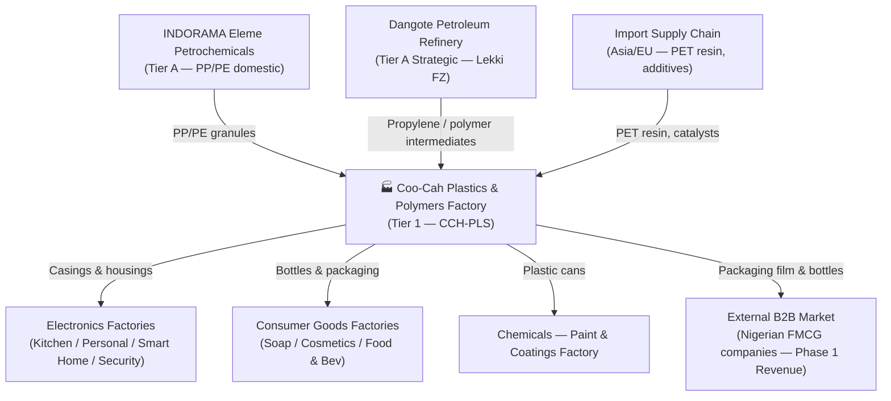

# Coo-Cah Plastics & Polymers Factory

> **Tier 1 Critical Infrastructure** — This factory supplies plastic casings, packaging, bottles,
> and structural parts to **every other Coo-Cah factory vertical**. It must be commissioned before
> or in parallel with the first revenue-generating (Tier 2) factories.

---

## Factory Overview

| Attribute           | Detail                                                                   |
|---------------------|--------------------------------------------------------------------------|
| **Factory Name**    | Coo-Cah Plastics & Polymers Factory                                      |
| **Repository**      | `coo-cah-factory-chemicals-plastics`                                     |
| **Vertical**        | Chemicals                                                                |
| **Sub-Vertical**    | Plastics — Injection moulding, extrusion, blown film, PET                |
| **Location**        | Agbara Industrial Estate, Lagos State / Sagamu, Ogun State, Nigeria      |
| **Tier**            | Tier 1 — Critical Infrastructure                                         |
| **Phase**           | Phase 1 (Planning / Development)                                         |
| **Status**          | PLANNED                                                                  |
| **Facility Area**   | ~22,000 m² (full scale); start with ~5,000–8,000 m² leased bay           |
| **Peak Power Load** | ~1,100 kW (full scale); 200–300 kW at initial start                     |
| **Solar PV Target** | 800 kWp (full scale); 200 kWp starting                                   |
| **BESS Target**     | 900 kWh LFP (full scale); 250 kWh LFP starting                          |
| **Employees**       | ~45 (Phase 1 initial); ~120 (Phase 1 full ramp)                         |
| **Master Repo**     | [Coo-Kah-Doks](https://github.com/oumar-code/Coo-Kah-Doks)              |

---

## Products — Phase 1

| SKU Code        | Product Description                                   | Process            | Priority     |
|-----------------|-------------------------------------------------------|--------------------|--------------|
| CCH-PLS-001     | Injection-moulded ABS/PC housings (Electronics)       | Injection moulding | Phase 1 Mid  |
| CCH-PLS-002     | HIPS refrigerator interior liners                     | Injection moulding | Phase 1 Mid  |
| **CCH-PLS-003** | **PP/PE blown film packaging**                        | **Film extrusion** | **Phase 1 Start** |
| **CCH-PLS-004** | **PET preforms and bottles (Consumer goods)**         | **Injection/SBM**  | **Phase 1 Start** |
| CCH-PLS-005     | EPS foam packaging inserts                            | Foam moulding      | Phase 1 Late |
| CCH-PLS-006     | HDPE pipe and fittings (construction + agriculture)   | Pipe extrusion     | Phase 1 Mid  |
| CCH-PLS-007     | Plastic retail crates and containers                  | Injection moulding | Phase 1 Mid  |
| CCH-PLS-008     | Recycled rPET/rHDPE post-consumer pellets             | Recycling/compounding | Phase 1 Late |

> **Starting focus:** CCH-PLS-003 (blown film) and CCH-PLS-004 (PET bottles) — broadest B2B
> demand in the Nigerian market and simplest processes to commission first.

---

## Strategic Role in the Coo-Cah Ecosystem

This factory is the **most strategically critical facility** in the entire Coo-Cah manufacturing
ecosystem. It is the single internal supplier of plastic components to all other verticals.

---

## Strategic Suppliers

### 🔶 INDORAMA Eleme Petrochemicals — Primary PP/PE Supplier (Tier A Critical)
- **Location:** Port Harcourt, Rivers State, Nigeria
- **Significance:** Nigeria's largest domestic PP/PE producer
- **Role:** Primary feedstock for all polyolefin product lines (CCH-PLS-003, CCH-PLS-006, CCH-PLS-007)
- **Strategy:** Negotiate long-term supply contract; maintain 30-day safety stock minimum

### 🔶 Dangote Petroleum Refinery — Strategic Feedstock Partner (Tier A Strategic)
- **Location:** Lekki Free Zone, Lagos (~60 km from Agbara via road)
- **Significance:** Africa's largest single-train refinery with planned petrochemical downstream
- **Role:** Propylene and polymer intermediates; logistics via Dangote's own trucking fleet
- **Strategy:** Negotiate long-term offtake agreement; position Coo-Cah as anchor domestic polymer customer. Dangote has publicly stated petrochemical downstream ambitions — early engagement is a strategic imperative.
- **Logistics:** Same-day road transport Lekki → Agbara Industrial Estate

---

## Phase 1 Implementation Checklist

### Site & Legal
- [ ] Execute lease for 5,000–8,000 m² bay at Agbara Industrial Estate
- [ ] Incorporate factory operating entity (RC number, FIRS TIN)
- [ ] Open corporate bank accounts; set up treasury for CapEx drawdown

### Regulatory & Permitting
- [ ] NESREA environmental operating permit
- [ ] DPR/NUPRC permit for hydrocarbon feedstock handling
- [ ] NAFDAC registration for food-contact plastics (PET bottles — CCH-PLS-004)
- [ ] SON product certification for structural plastics
- [ ] NCS Form M registration for imports
- [ ] Lagos State Fire Service clearance

### Infrastructure & Utilities
- [ ] 33 kV grid connection or DISCOM industrial tariff agreement
- [ ] Install 200 kWp solar PV system + 250 kWh LFP BESS
- [ ] Commission diesel generator (backup)
- [ ] Install compressed air system (screw compressors + ring main)
- [ ] Commission chilled water / cooling tower system
- [ ] Establish ETP (Effluent Treatment Plant) for process water discharge

### Equipment Procurement
- [ ] Blown film extrusion line(s) — CCH-PLS-003 start
- [ ] PET preform injection + stretch blow moulding — CCH-PLS-004 start
- [ ] DCS hardware (Honeywell Experion PKS or Siemens PCS 7)
- [ ] SIS hardware (SIL 2 rated — Triconex or equivalent)
- [ ] MES software licences and server infrastructure
- [ ] QC lab equipment
- [ ] IoT sensor deployment (target ≥ 85% asset coverage)

### Supplier Agreements
- [ ] Sign HOA / MOU with INDORAMA Eleme (PP/PE)
- [ ] Open engagement with Dangote Refinery commercial team (propylene/intermediates)
- [ ] Qualify 2+ import agents for PET resin (Apapa Port, Form M)
- [ ] Qualify local catalyst/additive importers (90-day safety stock plan)

### Certifications (Phase 1 targets)
- [ ] ISO 9001:2015 Quality Management
- [ ] ISO 14001:2015 Environmental Management
- [ ] ISO 45001:2018 Health & Safety
- [ ] ISO 50001:2018 Energy Management

### Production Commissioning
- [ ] Trial run CCH-PLS-003 (blown film) — first 1,000 kg
- [ ] Trial run CCH-PLS-004 (PET preforms/bottles) — first 10,000 units
- [ ] First external B2B customer delivery
- [ ] Full Phase 1 line ramp to target OEE ≥ 75%

---

## Documentation Index

| Document | Description |
|----------|-------------|
| [MASTER_REPO_REF.md](./MASTER_REPO_REF.md) | Link to master repo, version reference, standards traceability |
| [docs/machinery.md](./docs/machinery.md) | Full equipment register: moulders, extruders, DCS, SIS, QC lab, energy |
| [docs/energy-profile.md](./docs/energy-profile.md) | Power demand analysis, solar/BESS sizing |
| [docs/floor-plan.md](./docs/floor-plan.md) | Site layout: production zones, chemical storage, utilities |
| [docs/automation-roadmap.md](./docs/automation-roadmap.md) | DCS/SIS/MES → AI optimisation → autonomous control roadmap |
| [docs/supply-chain.md](./docs/supply-chain.md) | INDORAMA + Dangote sourcing, import protocol, intra-group flows |
| [docs/regulatory.md](./docs/regulatory.md) | NESREA, DPR, SON, NAFDAC, NCS compliance checklist |
| [docs/capex-opex.md](./docs/capex-opex.md) | Financial model: phased CapEx, OpEx, unit economics |
| [docs/digital-twin.md](./docs/digital-twin.md) | Process asset registry, sensor map, DCS/SCADA integration |
| [docs/mes-integration.md](./docs/mes-integration.md) | Batch MES, DCS integration, API endpoints, AI data feeds |

---

## Repository Governance

This repository is part of the **Coo-Cah Technologies Holdings** manufacturing ecosystem.

- **Master orchestrating repo:** [oumar-code/Coo-Kah-Doks](https://github.com/oumar-code/Coo-Kah-Doks)
- **Factory template version:** v1.0
- **Standards reference:** All group-wide standards (ISO, automation phases, supply chain doctrine, energy strategy, AI platform, MES integration) are defined in `docs/` of the master repo.
- **Traceability:** Factory blueprints originate from `factories/chemicals/plastics/` in the master repo.

> All documents in this repository must be consistent with and traceable back to Coo-Kah-Doks.

---

*Coo-Cah Technologies Holdings · Manufacturing Ecosystem · Plastics & Polymers Factory*
