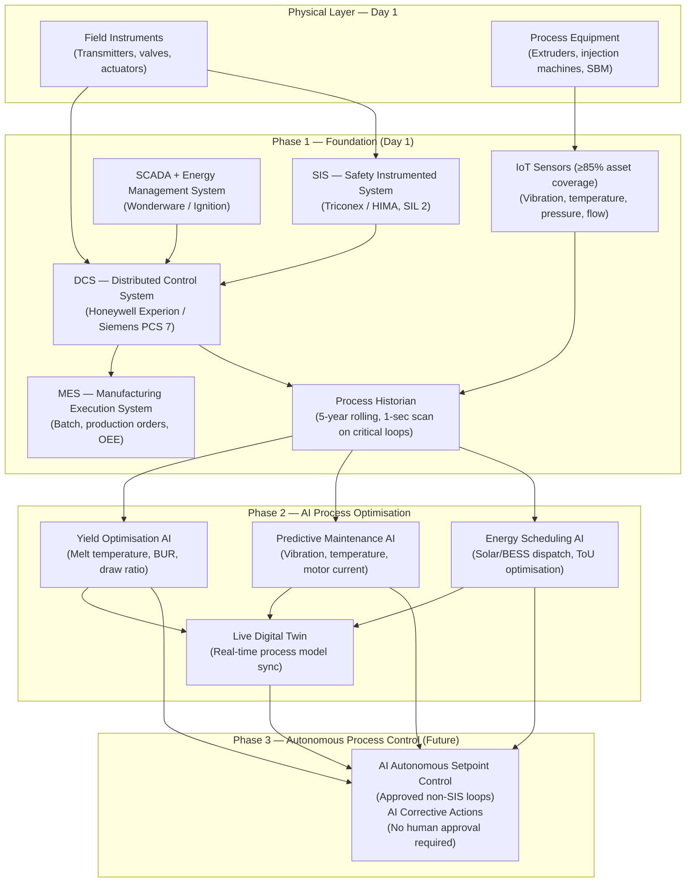
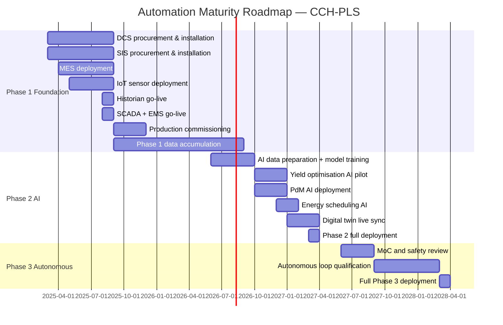

# Automation Roadmap

**Factory:** Coo-Cah Plastics & Polymers Factory (CCH-PLS)
**Document:** Automation & Digitalisation Roadmap v1.0
**Status:** PLANNED — Phase 1 Design Basis
**Master Repo Reference:** [Coo-Kah-Doks / docs / automation-strategy.md](https://github.com/oumar-code/Coo-Kah-Doks)

---

## Important Context: Chemical/Polymer Process vs. Discrete Assembly

> **This is a chemical/polymer process plant — not a discrete assembly factory.**
>
> The automation foundation here is the **DCS (Distributed Control System)** and
> **SIS (Safety Instrumented System)** — not AMRs, cobots, or assembly robots.
>
> DCS and SIS are present **from Day 1** — they are not optional upgrades. Process control
> and process safety are inseparable from operations in polymer manufacturing.

---

## 1. Automation Architecture Overview

---

## 2. Phase 1 — Foundation Automation (Day 1)

**Timeline:** Month 0–6 (commissioning through initial production)

### 2.1 Distributed Control System (DCS)

The DCS is the central automation platform for all continuous process control in the factory.

| Control Domain | Loop Type | Control Strategy |
|----------------|-----------|-----------------|
| Extruder barrel temperature (zones 1–6) | PID cascade | Zone setpoints + melt temperature feedback |
| Extruder die head pressure | PID | Pressure → screw speed cascade |
| Extruder screw speed / throughput | PID + ramp | Setpoint from MES production recipe |
| Blow-up ratio (BUR) control | Ratio control | Nip roll speed vs. screw speed ratio |
| Film haul-off speed | PID | Thickness feedback (gauge measurement) |
| PET oven temperature profiles | Multi-zone PID | SBM stretch oven setpoints |
| PET preform injection pressure | PID | Hydraulic pressure + position |
| Injection mould cooling water temp | PID | Chilled water valve position |
| Pipe extrusion haul-off speed | Ratio | Wall thickness feedback |
| Granule dryer temperature | PID | Desiccant bed temperature |
| Chilled water supply temperature | Cascade PID | Chiller setpoint + process load |
| Compressed air header pressure | On/off + PID | Compressor sequencing |
| Energy management (BESS/solar) | Supervisory | EMS layer |

**DCS Phase 1 KPIs:**
- DCS uptime: ≥ 99.5% (excl. planned maintenance)
- Loop availability: 100% of critical loops operational
- Alarm response time: 100% of priority-1 alarms actioned within 2 minutes

### 2.2 Safety Instrumented System (SIS)

The SIS operates independently of the DCS. It monitors SIL 2 safety functions and executes
Emergency Shutdown (ESD) automatically.

| Safety Instrumented Function (SIF) | SIL Level | Action |
|-------------------------------------|-----------|--------|
| SIF-001: High extruder barrel pressure | SIL 2 | ESD — power off heaters + screw stop |
| SIF-002: High melt temperature (> 330 °C) | SIL 2 | ESD — screw stop + alarm |
| SIF-003: Loss of melt pressure feedback | SIL 2 | ESD — controlled stop |
| SIF-004: Fire/smoke detection in production | SIL 2 | ESD — zone isolation + suppression arm |
| SIF-005: Toxic VOC high-high level | SIL 2 | ESD — ventilation max + zone evac alarm |
| SIF-006: Compressed air header low-low | SIL 1 | Controlled shutdown of pneumatic tools |
| SIF-007: Chilled water loss (mould cooling) | SIL 1 | Injection machine cycle hold |
| SIF-008: PET dryer high temperature | SIL 2 | Dryer ESD |

**SIS Phase 1 Requirements:**
- IEC 61511 functional safety lifecycle compliance
- SIS completely independent hardware, power, and cabling from DCS
- Annual SIF proof testing per SIL validation study
- No DCS bypass of SIS functions permitted (Management of Change required)

### 2.3 Manufacturing Execution System (MES)

| MES Function | Phase 1 Implementation |
|--------------|----------------------|
| Production order management | Receive work orders from ERP; dispatch to DCS recipe system |
| Recipe management | Product-specific DCS parameter sets (temperature profiles, speeds, ratios) |
| Material traceability | Raw material lot → production batch → finished goods lot |
| OEE tracking | Availability, Performance, Quality per line per shift |
| Downtime logging | Categorised causes (planned, breakdown, changeover, quality hold) |
| Quality data capture | QC lab results linked to batch records |
| Batch record (eBR) | Electronic batch record for food-contact products (NAFDAC) |
| Shift reports | Automated PDF shift summary |
| DCS integration | OPC UA gateway, 1-second tag polling |

### 2.4 IoT Sensor Programme

**Target: ≥ 85% of production assets covered by IoT sensors by end of Phase 1**

| Asset Category | Sensors Deployed | Data Points |
|----------------|-----------------|-------------|
| Extruder gearbox | Vibration (3-axis), temperature, oil pressure | Bearing health, gear mesh frequency |
| Injection machine clamp | Clamp force transducer, tie-bar strain | Mould protection |
| All motor drives (>15 kW) | Current, voltage, power factor, speed | Motor health, energy |
| Cooling water system | Flow meters, temperature (supply/return), ΔP | Fouling detection, COP |
| Compressed air | Flow, pressure, dew point at each machine | Leak detection, consumption |
| BESS racks | Cell voltage, temperature, SoC per module | BESS health |
| Diesel generator | Run hours, fuel level, temperature, exhaust | Predictive maintenance |
| Fire & gas | Smoke, heat, VOC (multi-point) | Safety |

### 2.5 Process Historian

| Parameter | Value |
|-----------|-------|
| Platform | OSIsoft PI (AVEVA PI) or Aveva Historian |
| Tag count (Phase 1) | ~2,500 tags |
| Critical loop scan rate | 1 second |
| Standard tag scan rate | 10 seconds |
| Retention period | 5 years rolling (regulatory and AI training requirement) |
| Backup | Daily off-site (cloud or secondary server) |
| Access | Read-only API for MES, AI platform, reporting |

---

## 3. Phase 2 — AI Process Optimisation (Month 12–24)

**Prerequisite:** 6+ months of high-quality historian data from Phase 1 production.

### 3.1 AI Yield Optimisation

**Purpose:** Reduce raw material waste and improve product consistency by learning optimal
process setpoints from historical data.

| Application | Input Features | AI Technique | Expected Benefit |
|-------------|---------------|--------------|-----------------|
| Blown film thickness uniformity | Extruder speed, BUR, nip roll speed, temperature | LSTM/RNN + reinforcement learning | ±2% → ±0.5% thickness variation |
| PET preform IV / AA optimisation | Dryer temperature, time, melt temp, hold time | Gaussian process regression | AA reduction 20–30% |
| HDPE pipe wall thickness | Screw speed, haul-off speed, cooling rate | Model predictive control (MPC) | ±3% → ±1% wall variation |
| Colour consistency | Masterbatch dosing, mixing, melt temp | Gradient boosting | ΔE reduction ≥ 40% |
| Overall yield improvement | Regrind rate, scrap % per shift | Anomaly detection + root cause | +3–5% yield improvement |

### 3.2 Predictive Maintenance AI (PdM)

| Asset | Failure Mode | Sensor Inputs | AI Model | Lead Time |
|-------|-------------|---------------|----------|-----------|
| Extruder gearbox | Gear tooth fatigue / bearing spall | Vibration FFT, temperature | Random Forest + anomaly scoring | 2–4 weeks |
| Injection machine hydraulic pump | Cavitation, wear | Pressure ripple, current | Signal processing + SVM | 1–2 weeks |
| Chiller compressor | Refrigerant leak, bearing wear | Vibration, suction pressure, COP | Isolation Forest | 1–3 weeks |
| Air compressor | Valve failure | Pressure cycling pattern | Time-series anomaly | 1 week |
| Electric motors (all >15 kW) | Winding insulation, bearing | Current signature, temperature | Motor Current Signature Analysis (MCSA) | 2–6 weeks |
| BESS cells | Capacity fade, thermal runaway risk | Cell voltage, dV/dT, temperature | Physics-informed ML | Continuous |

**PdM Phase 2 KPIs:**
- Unplanned downtime reduction: -30% vs. Phase 1 baseline
- Maintenance cost reduction: -20% (reactive → planned maintenance shift)
- MTBF improvement: +25% for critical rotating equipment

### 3.3 Energy Scheduling AI

| Function | AI Model | Data Inputs |
|----------|----------|-------------|
| Solar generation forecast | Irradiance ML model + weather API | Pyranometer data, weather forecast |
| Load forecast | LSTM | MES production schedule, historical consumption |
| BESS dispatch optimisation | Linear programming / MPC | Solar forecast, load forecast, grid ToU tariff |
| Peak demand avoidance | Optimisation | Grid tariff, production flexibility windows |
| Energy intensity benchmarking | Regression | Production rate, temperature, ambient conditions |

### 3.4 Digital Twin (Live)

Phase 2 establishes a **live digital twin** of the factory, synchronised in real-time with
DCS and historian data. See [`docs/digital-twin.md`](./digital-twin.md) for full specification.

| Layer | Technology |
|-------|-----------|
| Process simulation | Aspen Plus / HYSYS dynamic model (polymer process) |
| Asset model | ISO 15926 compliant asset data model |
| Real-time sync | OPC UA + PI historian → twin update |
| Visualisation | 3D factory model (Unity/Unreal + industrial IoT overlay) |
| AI integration | Twin provides "virtual sensors" for unmeasured states |

---

## 4. Phase 3 — Autonomous Process Control (Month 30+)

**Prerequisite:** Phase 2 AI models validated with ≥ 12 months of production performance data.
**Governance:** Management of Change (MoC) approval + Engineering Safety Review for each loop.

### 4.1 Approved Loops for Autonomous Control

| Loop | Autonomous Action | Safety Constraint |
|------|------------------|-------------------|
| Blown film thickness control | Autonomous haul-off speed + BUR adjustment | Max ±5% setpoint deviation from qualified range |
| Melt temperature zone trimming | ±5 °C autonomous adjustment | Hard high/low limits enforced by DCS (never SIS) |
| PET dryer setpoint | Autonomous temperature/time optimisation | IV and AA in-spec verification gate |
| BESS dispatch | Full autonomous charge/discharge | Grid connection always maintained as fallback |
| Compressor sequencing | Autonomous start/stop sequencing | Manual override always available |

### 4.2 What Will NOT Be Autonomously Controlled (SIS Boundary)

> **The SIS boundary is inviolable.** AI systems have NO write access to SIS setpoints,
> SIF logic, or any safety loop. This is a hard architectural constraint — enforced
> by network segmentation and system design, not policy alone.

| System | Autonomous Control | Reason |
|--------|-------------------|--------|
| Emergency shutdown (ESD) | ❌ Never | IEC 61511 prohibits AI override of SIS |
| Fire suppression trigger | ❌ Never | Safety system — human verified |
| SIL 2 pressure/temperature limits | ❌ Never | Functional safety — fixed in SIS logic |
| Emergency evacuation systems | ❌ Never | Life safety |

### 4.3 Phase 3 KPIs

| KPI | Target |
|-----|--------|
| Autonomous loop uptime | ≥ 95% (loops operating without human intervention) |
| Quality deviation alerts actioned by AI | ≥ 80% before operator visibility |
| Energy optimisation savings (vs Phase 2) | Additional -10% |
| Operator workload reduction | -40% routine interventions |

---

## 5. Automation Maturity Timeline

---

## 6. Cybersecurity (OT Security)

| Layer | Implementation |
|-------|---------------|
| IT/OT network separation | VLAN segmentation + unidirectional gateway (data diode) |
| DCS access control | Role-based access, no remote access to SIS |
| Patch management | Isolated OT patch testing environment |
| Vulnerability scanning | Quarterly OT network scan (Claroty / Nozomi) |
| Incident response | OT-specific IR plan, SIS manual override capability always maintained |
| Standards compliance | IEC 62443 Industrial Cybersecurity |

---

*Document maintained under Coo-Kah-Doks group standards. Update as phases are commissioned.*
