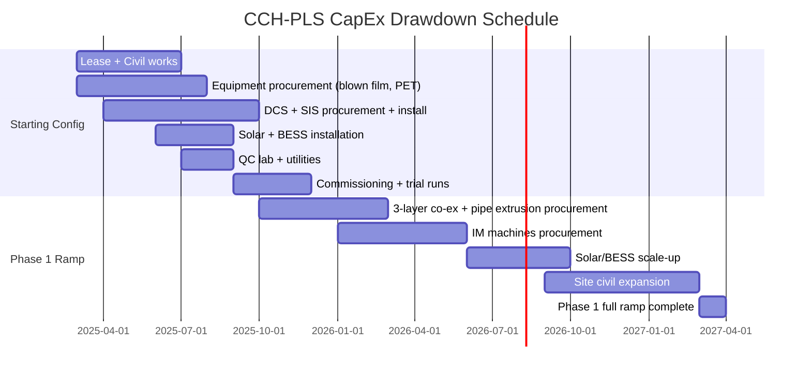

# CapEx / OpEx Financial Model

**Factory:** Coo-Cah Plastics & Polymers Factory (CCH-PLS)
**Document:** Financial Model — Phased CapEx, OpEx & Unit Economics v1.0
**Status:** PLANNED — Pre-FEED estimates (±30% accuracy)
**Currency:** Nigerian Naira (NGN) primary; USD reference for imported equipment
**FX Assumption:** 1 USD = NGN 1,600 (NAFEM/official rate — verify at FEED stage)

---

> **Important:** All figures are pre-FEED order-of-magnitude estimates. A formal FEED
> (Front End Engineering Design) study must be completed before financial close. CapEx
> accuracy is ±30% at this stage.

---

## 1. CapEx Summary — Phase 1

### 1.1 Starting Configuration (CCH-PLS-003 + CCH-PLS-004 Lines Only)

| Category | USD (000) | NGN (M) | Notes |
|----------|-----------|---------|-------|
| Land & Lease (5-year advance) | 80 | 128 | Agbara Industrial Estate — estimate |
| Civil & structural works | 350 | 560 | Factory fit-out, floor treatment, drainage, ETP |
| Blown film extrusion line (mono-layer) | 280 | 448 | China-sourced; FOB + shipping + installation |
| PET preform injection + SBM system | 520 | 832 | Complete system including dryer |
| DCS + SIS system (Phase 1) | 680 | 1,088 | Honeywell/Siemens; engineering, installation, commissioning |
| MES software + server infra | 180 | 288 | Opcenter or equivalent; 3-year licence |
| QC laboratory equipment | 220 | 352 | Full lab fit-out per machinery.md §3 |
| Solar PV 200 kWp + BESS 250 kWh | 380 | 608 | Turnkey EPC |
| Compressed air system | 90 | 144 | 2× 75 kW oil-free compressors + pipework |
| Chilled water system | 140 | 224 | 350 kW chiller + cooling tower |
| Diesel generator (500 kVA) | 95 | 152 | Incl. day tank and ATS |
| Utilities & building services | 120 | 192 | Lighting, fire suppression, HVAC, ETP basic |
| IoT sensors + networking | 85 | 136 | 85% asset coverage target |
| Silo storage (4× outdoor) | 45 | 72 | PP/PE/PET granule silos |
| Granule dryers + ancillary | 65 | 104 | Per machinery.md §1.5 |
| Warehouse racking + FG equipment | 55 | 88 | Racking, pallet trucks, dock equipment |
| Regulatory permits + EIA | 40 | 64 | NESREA, NUPRC, NAFDAC, SON, Fire |
| Working capital (raw materials) | 420 | 672 | 45-day raw material stock at start |
| Engineering + PMC | 180 | 288 | 6% of equipment and civil CapEx |
| Contingency (20%) | 602 | 963 | 20% on all items except working capital |
| **TOTAL Starting CapEx** | **~4,629** | **~7,406** | |

### 1.2 Full Phase 1 Ramp (All Product Lines)

| Additional Category (beyond Starting) | USD (000) | NGN (M) |
|---------------------------------------|-----------|---------|
| 3-layer co-ex blown film line | 580 | 928 |
| 2× injection moulding machines (120T) | 340 | 544 |
| 1× injection moulding machine (280T) | 380 | 608 |
| HDPE pipe extrusion line | 280 | 448 |
| Solar PV scale-up to 800 kWp | 780 | 1,248 |
| BESS scale-up to 900 kWh | 620 | 992 |
| Grid transformer upgrade (1,500 kVA) | 160 | 256 |
| Site expansion (civil + fit-out) | 680 | 1,088 |
| Additional DCS I/O expansion | 120 | 192 |
| Additional working capital | 800 | 1,280 |
| Engineering + contingency (20%) | 748 | 1,197 |
| **Additional Phase 1 Full CapEx** | **~5,488** | **~8,781** |
| **TOTAL Phase 1 Full CapEx** | **~10,117** | **~16,187** |

---

## 2. CapEx Phasing Timeline

---

## 3. Operating Expenditure (OpEx) — Monthly

### 3.1 OpEx at Starting Configuration (~280 kW production load, 2-shift, 5 days)

| OpEx Category | Monthly (NGN M) | Monthly (USD K) | % of Total OpEx |
|---------------|-----------------|-----------------|-----------------|
| Raw materials (PP/PE/PET + additives) | 112 | 70 | 38% |
| Energy (grid — residual after solar) | 9.6 | 6 | 3% |
| Labour (45 employees) | 28.8 | 18 | 10% |
| Maintenance & spare parts | 9.6 | 6 | 3% |
| Packaging materials | 14.4 | 9 | 5% |
| Quality & compliance (lab consumables, testing) | 4.8 | 3 | 2% |
| Logistics (inbound) | 9.6 | 6 | 3% |
| Logistics (outbound — to group factories + B2B) | 6.4 | 4 | 2% |
| Regulatory & compliance (permits, audits) | 3.2 | 2 | 1% |
| General & admin + overheads | 16.0 | 10 | 5% |
| Depreciation (CapEx / 10-yr straight line) | 74.1 | 46 | 25% |
| Debt service (if project financed at 60% debt) | 19.2 | 12 | 6% |
| **Total Monthly OpEx** | **~307.7** | **~192** | **100%** |

### 3.2 Full Phase 1 Ramp OpEx (1,100 kW peak load, 3-shift, 6 days)

| OpEx Category | Monthly (NGN M) | Monthly (USD K) |
|---------------|-----------------|-----------------|
| Raw materials | 620 | 388 |
| Energy (grid — residual after 800 kWp solar) | 38.4 | 24 |
| Labour (120 employees) | 76.8 | 48 |
| Maintenance & spare parts | 32.0 | 20 |
| Packaging materials | 64.0 | 40 |
| Quality & compliance | 12.8 | 8 |
| Logistics (inbound) | 48.0 | 30 |
| Logistics (outbound) | 32.0 | 20 |
| Regulatory & compliance | 9.6 | 6 |
| General & admin + overheads | 48.0 | 30 |
| Depreciation (CapEx / 10-yr) | 161.9 | 101 |
| Debt service | 80.0 | 50 |
| **Total Monthly OpEx** | **~1,223.5** | **~765** |

---

## 4. Unit Economics

### 4.1 CCH-PLS-003 — PP/PE Blown Film

| Parameter | Value |
|-----------|-------|
| Machine throughput | 80–120 kg/hr (mono-layer), 150–200 kg/hr (3-layer) |
| Annual production capacity (Phase 1 full) | ~3,500 MT/year (combined lines) |
| Raw material cost (PP/PE at NGN 680/kg domestic) | NGN 680/kg |
| Energy cost per kg (0.55 kWh/kg × NGN 60/kWh net) | NGN 33/kg |
| Labour + overhead per kg | NGN 45/kg |
| Total production cost per kg | ~NGN 758/kg |
| Market selling price (Lagos B2B packaging film) | NGN 1,100–1,350/kg |
| Gross margin | ~30–38% |
| Contribution margin per MT | ~NGN 342,000–592,000 |
| Break-even utilisation | ~62% of capacity |

### 4.2 CCH-PLS-004 — PET Preforms & Bottles

| Parameter | Value |
|-----------|-------|
| Machine output | 96-cavity mould at 4,800 preforms/hr |
| Annual production capacity (Phase 1 preforms) | ~200M preforms/year (at 85% OEE) |
| Bottle conversion (SBM) | ~150M 500 mL PET bottles/year |
| PET resin cost (import, ~$1,100/MT CIF) | NGN 1,760/kg |
| Energy cost per kg | NGN 48/kg |
| Labour + overhead per kg | NGN 55/kg |
| Total production cost per kg PET bottle | ~NGN 1,863/kg |
| Market selling price (0.5L PET bottle, Lagos) | NGN 35–50 per bottle = ~NGN 1,960–2,800/kg |
| Gross margin | ~5–33% (depends on customer and specification) |
| Revenue potential (150M bottles/year at NGN 40/bottle) | NGN 6,000M/year (~$3.75M) |

### 4.3 Energy Cost Comparison

| Scenario | Cost/kWh (NGN) | Annual Cost (full scale) | Saving vs Grid-Only |
|----------|---------------|--------------------------|---------------------|
| Grid-only (no solar) | 85–120 | NGN 158M–224M/year | Baseline |
| Solar + BESS (200 kWp, 250 kWh) | ~55 blended | ~NGN 103M/year | ~35% |
| Solar + BESS (800 kWp, 900 kWh) | ~38 blended | ~NGN 71M/year | ~55% |

---

## 5. Revenue Projection — Phase 1

### 5.1 Starting Configuration (CCH-PLS-003 + 004, external B2B only)

| Year | Production (MT eq.) | Revenue (NGN M) | Revenue (USD M) | Notes |
|------|---------------------|-----------------|-----------------|-------|
| Year 1 (ramp) | 800 MT | 1,040 | 0.65 | 40% capacity utilisation |
| Year 2 | 2,000 MT | 2,800 | 1.75 | 80% utilisation |
| Year 3 (+ intra-group) | 3,500 MT | 5,250 | 3.28 | All Phase 1 lines + intra-group supply |

### 5.2 Key Revenue Assumptions

| Assumption | Value |
|------------|-------|
| Utilisation ramp | 40% → 65% → 85% (Years 1–3) |
| Blended selling price (all products) | NGN 1,300–1,500/kg |
| External B2B (Phase 1): proportion | 70% of volume |
| Intra-group supply: proportion | 30% of volume (grows to 50% by Phase 1 full) |
| External B2B pricing basis | Lagos market price |
| Intra-group pricing | Cost + 12% internal margin |

---

## 6. Financial Returns Summary

| Metric | Starting Config | Full Phase 1 |
|--------|----------------|-------------|
| Total CapEx | ~$4.6M / NGN 7.4B | ~$10.1M / NGN 16.2B |
| Break-even revenue | ~NGN 370M/month | ~NGN 1,470M/month |
| Payback period (simple) | ~5.5 years | ~6.5 years |
| IRR (10-year, base case) | ~18–22% | ~20–25% |
| EBITDA margin (steady state) | ~22–28% | ~25–32% |

> **Note:** Returns are highly sensitive to FX rate (NGN/USD), raw material pricing (especially
> PET import parity), and grid energy cost. A full sensitivity analysis must be conducted at
> FEED stage with locked financing terms.

---

## 7. Funding Strategy

| Tranche | Source | Amount | Purpose |
|---------|--------|--------|---------|
| Equity (Coo-Cah Holdings) | Internal | 40% of CapEx | Foundation infrastructure |
| Project finance (DFI) | Development Bank of Nigeria (DBN), Bank of Industry (BOI), or AFC | 50% of CapEx | Equipment and civil |
| Trade finance (LC) | Commercial bank (LCBC, GTB, Zenith) | 10% working capital line | Raw material imports |
| Grants (optional) | NIRSAL, NIDCOM agro-industrial programmes | Supplemental | Energy and local manufacturing incentive |

---

*Financial model to be updated with actuals at FEED stage and post-commissioning. Maintained under Coo-Kah-Doks group standards.*
