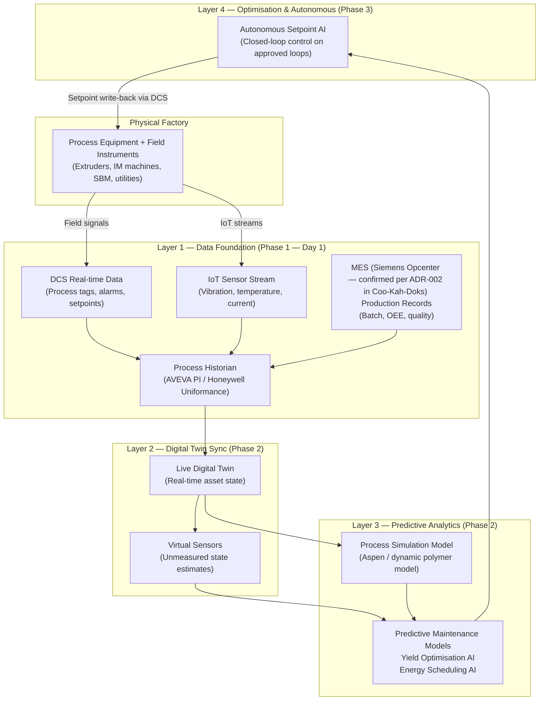
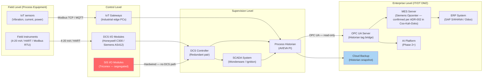

# Digital Twin

**Factory:** Coo-Cah Plastics & Polymers Factory (CCH-PLS)
**Document:** Digital Twin Architecture & Asset Registry v1.0
**Status:** PLANNED — Phase 1 Foundation; Phase 2 Live Twin
**Master Repo Reference:** [Coo-Kah-Doks — platform/digital-twin-platform-architecture.md](https://github.com/oumar-code/Coo-Kah-Doks/blob/main/platform/digital-twin-platform-architecture.md)

---

## 1. Digital Twin Concept

The digital twin for CCH-PLS is a **layered data and model system** that grows in fidelity
from Phase 1 (data collection) through Phase 2 (live synchronised model) to Phase 3
(predictive + autonomous).



---

## 2. Process Asset Registry

### 2.1 Asset Hierarchy

The digital twin asset hierarchy follows the ISA-95 / ISO 15926 model:

```
CCH-PLS (Site)
├── AREA-A (Extrusion Hall)
│   ├── UNIT-A1 (Blown Film Line 1 — Mono)
│   │   ├── EXT-A1-01 (Extruder — 55 mm)
│   │   ├── DIE-A1-01 (Blown film die head)
│   │   ├── AIR-A1-01 (Air ring + bubble cage)
│   │   ├── NIP-A1-01 (Nip roll assembly)
│   │   ├── WIND-A1-01 (Winder #1)
│   │   └── WIND-A1-02 (Winder #2)
│   ├── UNIT-A2 (Blown Film Line 2 — 3-Layer Co-ex)
│   │   ├── EXT-A2-01 (Extruder A — 45 mm)
│   │   ├── EXT-A2-02 (Extruder B — 45 mm)
│   │   ├── EXT-A2-03 (Extruder C — 45 mm)
│   │   ├── DIE-A2-01 (3-layer co-ex die head)
│   │   └── ... (winders, corona)
│   └── UNIT-A3 (HDPE Pipe Line)
│       ├── EXT-A3-01 (Pipe extruder — 90 mm)
│       ├── DIE-A3-01 (Pipe die)
│       ├── CAL-A3-01 (Calibration tank)
│       ├── COOL-A3-01 (Cooling trough)
│       └── HAUL-A3-01 (Haul-off / saw)
├── AREA-B (Moulding Hall)
│   ├── UNIT-B1 (PET Preform System)
│   │   ├── DRY-B1-01 (PET crystalliser + dryer)
│   │   ├── IM-B1-01 (PET preform injection machine)
│   │   ├── COOL-B1-01 (Post-mould cooling robot)
│   │   ├── CONV-B1-01 (Preform conveyor to SBM)
│   │   └── SBM-B1-01 (Stretch blow moulding machine)
│   ├── UNIT-B2 (Injection Moulding — 120T #1)
│   │   └── IM-B2-01 (All-electric IM 120T)
│   ├── UNIT-B3 (Injection Moulding — 120T #2)
│   │   └── IM-B3-01 (All-electric IM 120T)
│   └── UNIT-B4 (Injection Moulding — 280T)
│       └── IM-B4-01 (Hydraulic IM 280T)
├── AREA-E (Utilities)
│   ├── UNIT-E1 (Chilled Water System)
│   │   ├── CHILL-E1-01 (Chiller — 350 kW)
│   │   ├── CT-E1-01 (Cooling tower)
│   │   ├── PUMP-E1-01 (CW pump #1)
│   │   └── PUMP-E1-02 (CW pump #2)
│   ├── UNIT-E2 (Compressed Air)
│   │   ├── COMP-E2-01 (Screw compressor #1 — 75 kW)
│   │   ├── COMP-E2-02 (Screw compressor #2 — 75 kW)
│   │   └── DRY-E2-01 (Refrigerant dryer)
│   ├── UNIT-E3 (Power Systems)
│   │   ├── SOLAR-E3-01 (Solar PV array)
│   │   ├── INV-E3-01 (String inverters)
│   │   ├── BESS-E3-01 (LFP BESS rack 1)
│   │   ├── BESS-E3-02 (LFP BESS rack 2)
│   │   └── GEN-E3-01 (Diesel generator)
│   └── UNIT-E4 (ETP)
│       └── ETP-E4-01 (Effluent treatment plant)
```

---

## 3. Sensor Map — Phase 1 IoT Coverage

The detailed sensor registry has been moved to [docs/sensor-map.md](./sensor-map.md).

This standalone document now serves as the authoritative source for:

- Tag naming convention and scan-rate policy
- Expanded per-asset sensor tables (including protocol and gateway assignment)
- Coverage summary against Phase 1 instrumentation targets
- Cross-links to BIM asset anchors for physical sensor location context

---

## 4. DCS/SCADA Integration Architecture



**IT/OT Network Segmentation:**
- DCS network: Isolated VLAN, no internet access, no ERP direct connection
- OPC UA gateway: Unidirectional data diode (no write-back from MES (Siemens Opcenter — confirmed per ADR-002 in Coo-Kah-Doks)/ERP to DCS without explicit Engineering Change)
- SIS: Completely isolated — no network connection; hardwired only
- AI platform connection: Read-only historian data only in Phase 1/2; Phase 3 write-back via DCS approved loops only

---

## 5. Digital Twin Data Model

### 5.1 Asset Data Schema (per asset)

Each physical asset in the registry has a corresponding digital twin record:

```json
{
  "asset_id": "EXT-A1-01",
  "asset_name": "Blown Film Extruder Line 1",
  "asset_class": "EXTRUDER",
  "area": "AREA-A",
  "unit": "UNIT-A1",
  "manufacturer": "TBD",
  "model": "TBD",
  "serial_number": "TBD",
  "commissioned_date": null,
  "design_throughput_kg_hr": 120,
  "design_melt_temp_c": 230,
  "design_pressure_bar": 300,
  "motor_rated_kw": 75,
  "screw_diameter_mm": 55,
  "screw_LD_ratio": 30,
  "historian_tags": [
    "EXT-A1-01_TI_Z1", "EXT-A1-01_TI_Z2", "EXT-A1-01_TI_Z3",
    "EXT-A1-01_TI_Z4", "EXT-A1-01_TI_Z5", "EXT-A1-01_TI_Z6",
    "EXT-A1-01_TI_MELT", "EXT-A1-01_PI_HEAD", "EXT-A1-01_SI_SCREW",
    "EXT-A1-01_II_MOTOR", "EXT-A1-01_PI_MOTOR", "EXT-A1-01_VIB_GB"
  ],
  "maintenance_schedule": {
    "screw_barrel_inspection_hrs": 4000,
    "gearbox_oil_change_hrs": 8000,
    "heater_band_check_hrs": 2000
  },
  "twin_status": "PLANNED",
  "pdm_model_status": "PENDING_DATA_COLLECTION"
}
```

---

## 6. Phase Roadmap for Digital Twin

| Phase | Timeline | Twin Capability |
|-------|----------|----------------|
| Phase 1 | Month 0–12 | Asset registry populated; DCS/historian live; IoT sensors streaming; MES (Siemens Opcenter — confirmed per ADR-002 in Coo-Kah-Doks) linking batch to process data |
| Phase 1+ | Month 6–18 | Baseline performance models established from 6 months of production data |
| Phase 2 | Month 12–24 | Live synchronised twin; AI PdM models active; virtual sensors for unmeasured states |
| Phase 2+ | Month 18–30 | Process simulation model (Aspen dynamics) integrated; 3D visualisation layer |
| Phase 3 | Month 30+ | Twin drives autonomous setpoint recommendations; AI-to-DCS write-back on approved loops |

---

## 7. Digital Twin KPIs

| KPI | Phase 1 Target | Phase 2 Target | Phase 3 Target |
|-----|---------------|---------------|---------------|
| Asset registry completeness | 100% | 100% | 100% |
| IoT coverage of critical assets | ≥ 85% | ≥ 95% | ≥ 98% |
| Historian data availability | ≥ 99.0% | ≥ 99.5% | ≥ 99.9% |
| Virtual sensor accuracy (Phase 2) | — | ±5% of measured | ±2% of measured |
| PdM false alarm rate | — | ≤ 10% | ≤ 5% |
| PdM detection lead time | — | ≥ 2 weeks | ≥ 4 weeks |
| AI recommendation acceptance rate | — | — | ≥ 90% |

---

*Document maintained under Coo-Kah-Doks group standards. Asset registry to be updated as equipment is commissioned.*
