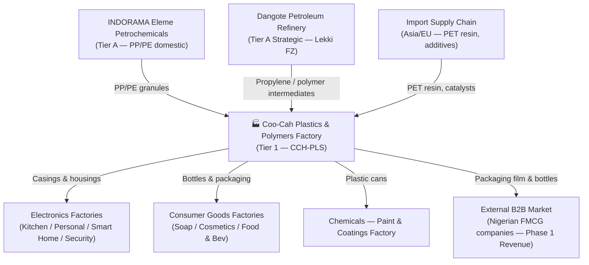

# Coo-Cah Plastics & Polymers Factory

> **Tier 1 — Critical Infrastructure** — This factory is the most strategically critical facility
> in the entire Coo-Cah manufacturing ecosystem. It is the **single internal supplier** of plastic
> components, packaging, bottles, and structural parts to every other Coo-Cah factory vertical.
> It must be commissioned before or in parallel with the first revenue-generating Tier 2 factories.
> See [master-repo-ref.md](./master-repo-ref.md) for traceability back to the
> [Coo-Kah-Doks](https://github.com/oumar-code/Coo-Kah-Doks) master repository.

---

## Factory Overview

| Attribute | Value |
|---|---|
| **Factory Name** | Coo-Cah Plastics & Polymers Factory |
| **Factory ID** | CCH-PLS |
| **Repository** | `coo-cah-factory-chemicals-plastics` |
| **Location** | Agbara Industrial Estate, Lagos State / Sagamu, Ogun State, Nigeria |
| **Vertical** | Chemicals |
| **Sub-Vertical** | Plastics — Injection moulding, extrusion, blown film, PET, foam |
| **Tier** | Tier 1 — Critical Infrastructure |
| **Phase** | Phase 1 (Priority) |
| **Status** | PLANNED |
| **Facility Area** | ~22,000 m² (full scale); initial ~5,000–8,000 m² leased bay |
| **Peak Power Load** | ~1,100 kW (full scale); 200–300 kW at initial start |
| **Solar PV Target** | 800 kWp (full scale); 200 kWp starting |
| **BESS Target** | 900 kWh LFP (full scale); 250 kWh LFP starting |
| **Employees (Phase 1)** | ~45 initial; ~120 Phase 1 full ramp |
| **Quality Standard** | ISO 9001:2015; ISO 14001:2015; ISO 45001:2018; ISO 50001:2018 |
| **Master Repo** | [oumar-code/Coo-Kah-Doks](https://github.com/oumar-code/Coo-Kah-Doks) |
| **Template Version** | v1.0 |

### Site & Infrastructure Notes

The factory is sited at **Agbara Industrial Estate** — Nigeria's most established manufacturing
zone, with dedicated industrial power infrastructure, road access to the Badagry Expressway, and
proximity to Apapa Port for raw material imports. An alternative or satellite location at **Sagamu,
Ogun State** (along the Sagamu–Ore expressway) provides access to the Lagos–Ibadan manufacturing
corridor and is under parallel evaluation for Phase 2 expansion.

Initial operations will occupy a **5,000–8,000 m² leased production bay** within an existing
industrial shed, minimising initial civil construction timelines. Full-scale build-out to ~22,000 m²
is planned across Phases 2 and 3 as production volumes and product range expand.

---

## Products — Phase 1 SKUs

| SKU Code | Product Description | Process | Priority |
|---|---|---|---|
| CCH-PLS-001 | Injection-moulded ABS/PC housings (Electronics) | Injection moulding | Phase 1 Mid |
| CCH-PLS-002 | HIPS refrigerator interior liners | Injection moulding | Phase 1 Mid |
| **CCH-PLS-003** | **PP/PE blown film packaging** | **Film extrusion** | **Phase 1 Start** |
| **CCH-PLS-004** | **PET preforms and bottles (Consumer goods)** | **Injection/SBM** | **Phase 1 Start** |
| CCH-PLS-005 | EPS foam packaging inserts | Foam moulding | Phase 1 Late |
| CCH-PLS-006 | HDPE pipe and fittings (construction + agriculture) | Pipe extrusion | Phase 1 Mid |
| CCH-PLS-007 | Plastic retail crates and containers | Injection moulding | Phase 1 Mid |
| CCH-PLS-008 | Recycled rPET/rHDPE post-consumer pellets | Recycling/compounding | Phase 1 Late |

> **Starting focus:** CCH-PLS-003 (blown film) and CCH-PLS-004 (PET bottles) — broadest B2B
> demand in the Nigerian market and the simplest processes to commission first.

### Phase 1 Revenue & Market Thesis

Nigeria consumes an estimated **1.5–2 million tonnes/year** of plastic products, of which a
significant portion is imported. The domestic packaging and beverage sectors represent the largest
near-term addressable markets:

- **Blown film (CCH-PLS-003):** FMCG and food companies in Lagos, Ogun, and Oyo states require
  hundreds of millions of metres of packaging film annually. Local supply is fragmented and
  unreliable; Coo-Cah can offer consistency, shorter lead times, and naira-denominated pricing.
- **PET bottles (CCH-PLS-004):** Nigeria's fast-growing bottled water, juice, and CSD sectors
  demand PET preforms and bottles at scale. Existing domestic converters are concentrated in Kano
  and Lagos but frequently operate below capacity. Coo-Cah's Agbara location places it within
  50 km of Nigeria's largest beverage cluster.

Phase 1 external B2B revenue is expected to fund 40–60% of operating costs before intra-group
volumes from the Electronics and Consumer Goods verticals ramp up.

---

## Strategic Role in the Coo-Cah Ecosystem

This factory is the **most strategically critical facility** in the entire Coo-Cah manufacturing
ecosystem. It is the single internal supplier of plastic components — casings, housings, bottles,
packaging film, foam inserts, and pipe — to all other verticals. No other Coo-Cah factory can reach
full production capacity without a reliable supply of plastic parts from this facility. Accordingly,
the Plastics & Polymers Factory is classified **Tier 1 Critical Infrastructure** and carries the
highest commissioning priority within Phase 1 of the Coo-Cah build-out.

Beyond intra-group supply, the factory targets the broader Nigerian and West African market from
day one. CCH-PLS-003 (blown film) and CCH-PLS-004 (PET bottles) address the enormous unmet local
demand currently served by imports or a fragmented domestic industry. Early external B2B revenue
from these two product lines is expected to cover operating costs and partially fund the Phase 1
expansion before intra-group volumes ramp. Once upstream Dangote Refinery petrochemical capacity
comes online, the factory is strategically positioned to become one of Nigeria's lowest-cost polymer
converters, with a direct pipeline from refinery gate to finished plastic product.

---

## Strategic Suppliers

### 🔶 INDORAMA Eleme Petrochemicals — Primary PP/PE Supplier (Tier A Critical)

- **Location:** Port Harcourt, Rivers State, Nigeria
- **Significance:** Nigeria's largest domestic PP/PE producer
- **Role:** Primary feedstock for all polyolefin product lines (CCH-PLS-003, CCH-PLS-006, CCH-PLS-007)
- **Strategy:** Negotiate long-term supply contract; maintain 30-day safety stock minimum

INDORAMA Eleme operates Nigeria's only world-scale polyolefin complex, producing polypropylene (PP)
and polyethylene (PE) grades suitable for blown film, pipe extrusion, and injection moulding.
Securing a formal long-term offtake agreement with INDORAMA is the single most critical commercial
step before commissioning. The factory's logistics window — Port Harcourt to Agbara via the
East–West Road and Benin–Lagos Expressway — is approximately 6–8 hours by road, enabling
weekly replenishment with manageable safety stock requirements.

### 🔶 Dangote Petroleum Refinery — Strategic Feedstock Partner (Tier A Strategic)

- **Location:** Lekki Free Zone, Lagos (~60 km from Agbara via road)
- **Significance:** Africa's largest single-train refinery with planned petrochemical downstream
- **Role:** Propylene and polymer intermediates; logistics via Dangote's own trucking fleet
- **Strategy:** Negotiate long-term offtake agreement; position Coo-Cah as anchor domestic polymer
  customer. Dangote has publicly stated petrochemical downstream ambitions — early engagement is a
  strategic imperative.
- **Logistics:** Same-day road transport Lekki → Agbara Industrial Estate

The Dangote Refinery's planned propylene and polyolefin downstream presents a **multi-decade
strategic opportunity** for Coo-Cah. By establishing an early commercial relationship as the
refinery's downstream anchor customer, Coo-Cah positions itself to benefit from:

- Naira-denominated polymer pricing (reducing FX exposure currently inherent in imported PET resin
  and specialty polymer grades)
- Integrated logistics — Dangote's dedicated fleet of tankers and bulk polymer carriers already
  services the Lekki–Lagos industrial corridor
- Potential co-investment in compounding or downstream conversion closer to the Dangote complex

### Import Supply Chain — PET Resin & Specialty Grades

For polymer grades not yet available domestically (notably PET resin, certain ABS/PC grades, and
additives), the factory will operate through accredited Form M import agents at Apapa Port. A
90-day safety stock discipline is maintained for all imported raw materials, and dual-sourcing from
at least two independent suppliers is required for each critical imported grade.

---

## Production Capacity Targets

| Product Category | Phase 1 (Yr 1–2) | Phase 2 (Yr 3–4) | Phase 3 (Yr 5+) | Unit |
|---|---|---|---|---|
| Blown Film (PP/PE packaging) | 5,000 | 12,000 | 25,000 | tonnes/year |
| PET Preforms / Bottles | 80,000,000 | 200,000,000 | 400,000,000 | units/year |
| ABS/PC Housings | 2,000,000 | 5,000,000 | 10,000,000 | units/year |
| HIPS Liners | 100,000 | 250,000 | 500,000 | units/year |
| EPS Foam Packaging | 800 | 2,000 | 4,000 | tonnes/year |
| HDPE Pipe & Fittings | 3,000 | 7,000 | 15,000 | tonnes/year |
| Retail Crates & Containers | 500,000 | 1,200,000 | 2,500,000 | units/year |
| rPET / rHDPE Pellets | 1,000 | 3,000 | 7,000 | tonnes/year |

---

## Automation Phase Status

| Phase | Scope | Status |
|---|---|---|
| Phase 1 | DCS/SIS commissioning, MES live, manual loading/unloading, basic AI process monitoring | In Planning |
| Phase 2 | Robotic material handling (AGV fleet), AI process optimisation, digital twin live, automated QC | Planned |
| Phase 3 | Autonomous process control (DCS AI loop), lights-out injection moulding lines (night), full predictive maintenance | Planned |

### Phase 1 Automation Detail

Phase 1 automation centres on establishing a reliable **DCS/SIS control layer** across the blown
film and PET lines, integrated with the group MES platform. Key Phase 1 automation deliverables:

- **DCS:** Honeywell Experion PKS or Siemens PCS 7 — controlling all process variables (melt
  temperature, screw speed, die gap, cooling air flow, winding tension) for the blown film line;
  injection pressure, pack/hold time, and cooling time for PET preform production
- **SIS:** SIL 2-rated safety instrumented system (Triconex or equivalent) covering all polymer
  melt overpressure, barrel overtemperature, and hazardous chemical handling interlocks
- **MES:** Real-time batch tracking, OEE dashboard, material consumption recording, QC sample
  logging — integrated with the Coo-Cah AI Platform via REST/MQTT
- **Basic AI:** Statistical process control (SPC) on key quality variables; anomaly detection on
  DCS process trends; energy consumption profiling

### Phase 2 & 3 Automation Roadmap

See [automation-roadmap.md](./automation-roadmap.md) for the full Phase 2 AGV deployment plan,
AI process optimisation model, digital twin architecture, and Phase 3 lights-out vision.

---

## Energy Profile Summary

| Parameter | Value |
|---|---|
| **Facility Area** | ~22,000 m² |
| **Estimated Peak Load** | ~1,100 kW |
| **Daily Energy Consumption** | ~7,500 kWh/day (16h operational) |
| **Recommended Solar PV** | 800 kWp rooftop + partial ground |
| **Recommended BESS** | 900 kWh LFP (Lithium Iron Phosphate) |
| **Lagos Irradiance** | 4.8 Peak Sun Hours/day |
| **Target Solar Self-Sufficiency** | ≥ 70% |
| **Annual CO₂ Avoidance (est.)** | ~750 tonnes CO₂/year |

> The 800 kWp + 900 kWh system is sized to cover daytime production loads for the blown film and
> PET lines, which together account for roughly 55% of total facility energy consumption. BESS
> dispatch prioritises DCS/SIS and MES systems during grid outages, ensuring uninterrupted process
> monitoring even on nights when solar generation is unavailable.

See [energy-profile.md](./energy-profile.md) for the full demand analysis, solar design, and cost model.

---

## Quality & Standards Programme

The factory is designed to achieve and maintain four management system certifications in parallel
from Phase 1:

| Standard | Scope | Phase 1 Target |
|---|---|---|
| ISO 9001:2015 | Quality Management System — all production and support processes | Certification within 18 months of commissioning |
| ISO 14001:2015 | Environmental Management System — effluent, emissions, waste | Certification within 24 months of commissioning |
| ISO 45001:2018 | Occupational Health & Safety — all factory zones | Certification within 18 months of commissioning |
| ISO 50001:2018 | Energy Management System — solar, BESS, grid, process energy | Certification within 24 months of commissioning |

The integrated management system (IMS) approach means a single document control framework,
unified audit calendar, and combined corrective action register serve all four standards. This
reduces administrative overhead and is aligned with the group-wide approach mandated in Coo-Kah-Doks.

### NESREA & Regulatory Compliance

The factory handles hydrocarbon-derived raw materials and produces polymer products regulated under
NESREA (National Environmental Standards and Regulations Enforcement Agency), DPR/NUPRC (for
feedstock handling), NAFDAC (food-contact plastics), and SON (Standards Organisation of Nigeria).
A comprehensive compliance calendar is maintained in [regulatory.md](./regulatory.md), with mandatory
effluent discharge monitoring, annual third-party environmental audits, and DPR/NUPRC quarterly
inspections built into the operational schedule.

---

## Circular Economy & Waste Management

CCH-PLS-008 (recycled rPET/rHDPE pellets) is both a product line and the factory's core
sustainability commitment. The recycling and compounding operation:

- Processes post-consumer plastic waste sourced from Lagos State's informal waste sector, providing
  an additional livelihood income stream for waste pickers and aggregators
- Produces rPET and rHDPE pellets suitable for re-entry into the factory's own production processes
  (closed-loop recycling) as well as sale to third-party converters
- Targets a **minimum 15% recycled content** blend in non-food-contact product lines by Phase 2
- Aligns with Nigeria's emerging single-use plastics regulation and positions Coo-Cah ahead of
  expected extended producer responsibility (EPR) legislation

Process scrap and edge trim from blown film and injection moulding operations are 100% reclaimed
and reintroduced into the production cycle, targeting a scrap-to-product rate of less than 3%
by end of Phase 1.

---

## Key Performance Indicators

| KPI | Phase 1 Target | Measurement Frequency |
|---|---|---|
| OEE (Overall Equipment Effectiveness) | ≥ 75% | Daily |
| Process Yield (polymer utilisation) | ≥ 94% | Per Batch |
| Product Defect Rate | < 3,000 ppm | Weekly |
| On-Time Delivery (intra-group + B2B) | ≥ 92% | Weekly |
| Energy Intensity (kWh/kg product) | ≤ 1.8 kWh/kg | Monthly |
| Solar Self-Sufficiency | ≥ 70% | Monthly |
| MES Data Completeness | ≥ 95% | Daily |
| Safety Incidents | Zero LTI | Continuous |
| Inventory Turns (raw polymer) | ≥ 8×/year | Monthly |
| NESREA Compliance (effluent) | 100% | Monthly |

---

## Phase 1 Implementation Checklist

### Site & Legal

- [ ] Execute lease for 5,000–8,000 m² bay at Agbara Industrial Estate
- [ ] Incorporate factory operating entity (RC number, FIRS TIN)
- [ ] Open corporate bank accounts; set up treasury for CapEx drawdown

### Regulatory & Permitting

- [ ] NESREA environmental operating permit
- [ ] DPR/NUPRC permit for hydrocarbon feedstock handling
- [ ] NAFDAC registration for food-contact plastics (PET bottles — CCH-PLS-004)
- [ ] SON product certification for structural plastics
- [ ] NCS Form M registration for imports
- [ ] Lagos State Fire Service clearance

### Infrastructure & Utilities

- [ ] 33 kV grid connection or DISCOM industrial tariff agreement
- [ ] Install 200 kWp solar PV system + 250 kWh LFP BESS
- [ ] Commission diesel generator (backup)
- [ ] Install compressed air system (screw compressors + ring main)
- [ ] Commission chilled water / cooling tower system
- [ ] Establish ETP (Effluent Treatment Plant) for process water discharge

### Equipment Procurement

- [ ] Blown film extrusion line(s) — CCH-PLS-003 start
- [ ] PET preform injection + stretch blow moulding — CCH-PLS-004 start
- [ ] DCS hardware (Honeywell Experion PKS or Siemens PCS 7)
- [ ] SIS hardware (SIL 2 rated — Triconex or equivalent)
- [ ] MES software licences and server infrastructure
- [ ] QC lab equipment
- [ ] IoT sensor deployment (target ≥ 85% asset coverage)

### Supplier Agreements

- [ ] Sign HOA / MOU with INDORAMA Eleme (PP/PE)
- [ ] Open engagement with Dangote Refinery commercial team (propylene/intermediates)
- [ ] Qualify 2+ import agents for PET resin (Apapa Port, Form M)
- [ ] Qualify local catalyst/additive importers (90-day safety stock plan)

### Certifications (Phase 1 targets)

- [ ] ISO 9001:2015 Quality Management
- [ ] ISO 14001:2015 Environmental Management
- [ ] ISO 45001:2018 Health & Safety
- [ ] ISO 50001:2018 Energy Management

### Production Commissioning

- [ ] Trial run CCH-PLS-003 (blown film) — first 1,000 kg
- [ ] Trial run CCH-PLS-004 (PET preforms/bottles) — first 10,000 units
- [ ] First external B2B customer delivery
- [ ] Full Phase 1 line ramp to target OEE ≥ 75%

---

## Cross-Factory Dependencies

| Dependency Type | Factory | Material / Service | Direction |
|---|---|---|---|
| Output | Coo-Cah Electronics Factories (Kitchen, Personal, Power, Smart Home) | ABS/PC housings, HIPS liners, packaging film | Outbound |
| Output | Coo-Cah Consumer Goods Factories | PET bottles, blown film packaging, foam inserts | Outbound |
| Output | Coo-Cah Chemicals (Paints) Factory | HDPE plastic cans | Outbound |
| Output | External B2B Market | Blown film, PET bottles, HDPE pipe — Phase 1 revenue | Outbound |
| Input | Coo-Cah Garage & Power Electronics | UPS + inverter backup power for DCS/SIS critical systems | Inbound |
| Input | INDORAMA Eleme (external Tier A) | PP/PE polymer granules | Inbound |
| Input | Dangote Refinery (external Tier A) | Propylene / polymer intermediates | Inbound |
| Shared Service | Coo-Cah AI Platform | MES, Digital Twin, Process Analytics, DCS integration | Bidirectional |

---

## Documentation Index

| Document | Description |
|---|---|
| [master-repo-ref.md](./master-repo-ref.md) | Master repo traceability, version reference, group standards |
| [implementation-plan.md](./implementation-plan.md) | Programme workstreams, gates, dependencies, and risk register |
| [machinery.md](./machinery.md) | Process plant and equipment register |
| [energy-profile.md](./energy-profile.md) | Power demand analysis, solar/BESS sizing |
| [floor-plan.md](./floor-plan.md) | Site layout: production zones, chemical storage, utilities |
| [automation-roadmap.md](./automation-roadmap.md) | DCS/SIS/MES → AI optimisation → autonomous control roadmap |
| [supply-chain.md](./supply-chain.md) | INDORAMA + Dangote sourcing, import protocol, intra-group flows |
| [intragroup-supply-coordination.md](./intragroup-supply-coordination.md) | Intercompany call-off model, SLAs, and escalation paths |
| [regulatory.md](./regulatory.md) | NESREA, DPR/NUPRC, NAFDAC, SON, NCS compliance |
| [capex-opex.md](./capex-opex.md) | Financial model: phased CapEx, OpEx, unit economics |
| [digital-twin.md](./digital-twin.md) | Process asset registry, sensor map, DCS/SCADA integration |
| [ai-platform-status.md](./ai-platform-status.md) | AI service inventory, endpoint readiness, and go-live blockers |
| [pentest-scoping.md](./pentest-scoping.md) | IT/OT security scope, rules of engagement, and deliverables |
| [gap-closure-report.md](./gap-closure-report.md) | Gate 1 closure status for supplementary docs and site readiness |
| [mes-integration.md](./mes-integration.md) | Batch MES, DCS integration, API endpoints, AI data feeds |

---

## Master Repository

This factory repository is part of the **Coo-Cah Technologies Holdings** manufacturing ecosystem.
The master orchestrating repository is [oumar-code/Coo-Kah-Doks](https://github.com/oumar-code/Coo-Kah-Doks).

All group-wide standards (ISO requirements, automation phases, supply chain doctrine, energy
strategy, AI platform, MES integration standards) are defined in the master repo and this repository
is fully traceable back to those standards. Factory blueprints originate from
`factories/chemicals/plastics/` in the master repo. See
[master-repo-ref.md](./master-repo-ref.md) for full traceability details.

---

*Coo-Cah Technologies Holdings · Manufacturing Ecosystem · Plastics & Polymers Factory*
