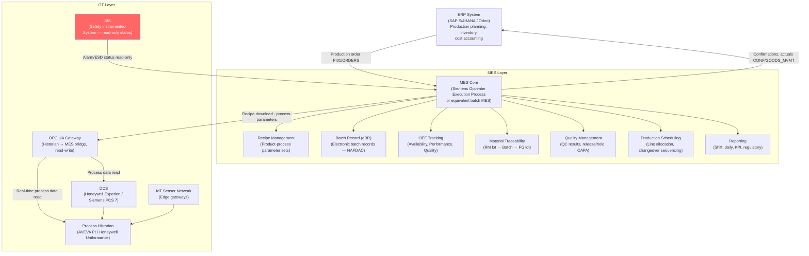
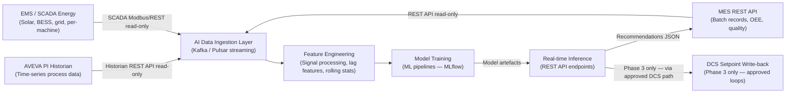

# MES Integration

**Factory:** Coo-Cah Plastics & Polymers Factory (CCH-PLS)
**Document:** MES Integration Architecture & API Specification v1.0
**Status:** PLANNED — Phase 1 Design Basis
**Master Repo Reference:** [Coo-Kah-Doks / docs / mes-integration-standards.md](https://github.com/oumar-code/Coo-Kah-Doks)

---

## 1. MES Overview

The Manufacturing Execution System (MES) at CCH-PLS manages production orders, batch records,
material traceability, OEE, and quality data. It operates as the **bridge between the DCS process
control layer and the ERP business system**.

---

## 2. Batch Manufacturing Process

CCH-PLS operates on a **continuous + batch hybrid** model:
- **Continuous processes:** Blown film extrusion, pipe extrusion (material flows continuously)
- **Batch processes:** Injection moulding (discrete shots), PET preform/SBM (discrete cycle), recipe changeovers

The MES manages both as "process orders" with batch records per production run.

### 2.1 Process Order Lifecycle

```mermaid
stateDiagram-v2
    [*] --> Created: ERP releases production order to MES
    Created --> Scheduled: MES scheduler assigns line, shift, material
    Scheduled --> Released: Material confirmed available (MES → ERP inventory check)
    Released --> Active: Operator confirms production start on HMI
    Active --> Active: DCS process data streaming to historian; MES OEE tracking live
    Active --> Suspended: Operator holds (quality check, changeover)
    Suspended --> Active: Hold lifted (QC release, changeover complete)
    Active --> Completed: Operator confirms production complete
    Completed --> QC_Review: QC lab reviews in-process and final results
    QC_Review --> Released_FG: QC releases batch
    QC_Review --> Quarantine: QC holds batch — disposition required
    Released_FG --> [*]: FG posted to inventory in ERP
    Quarantine --> Rework: Decision to rework
    Quarantine --> Scrapped: Decision to scrap
    Rework --> Active: New process order for rework
    Scrapped --> [*]: Scrap posted in ERP
```

---

## 3. DCS Integration

### 3.1 Integration Method

| Parameter | Specification |
|-----------|---------------|
| Protocol | OPC UA (IEC 62541) — preferred; OPC DA legacy fallback |
| Gateway | Industrial OPC UA server on OT network (Kepware / Matrikon / native DCS OPC) |
| Tag polling rate | Critical process loops: 1 second; OEE data: 10 seconds; energy: 1 second |
| Data direction | DCS → MES: read-only process data; MES → DCS: recipe parameter push (approved) |
| Recipe download | MES recipe parameters sent to DCS as setpoint batch on production order release |
| Alarm forwarding | DCS alarms priority 1–2 forwarded to MES alarm log (ISA-18.2 compliant) |
| Historian bridge | MES reads from AVEVA PI historian (not directly from DCS controller) for analytics |

### 3.2 Recipe Parameters Managed by MES → DCS

For each product SKU, MES holds the master recipe. On production order release, MES sends
the following parameter sets to DCS:

**CCH-PLS-003 (Blown Film) Recipe Parameters:**

| Parameter | Typical Range | Control Level |
|-----------|--------------|---------------|
| Zone 1–6 temperature setpoints | 170–230 °C (PE) / 210–250 °C (PP) | DCS PID setpoint |
| Die head temperature | 215–235 °C | DCS PID setpoint |
| Screw speed setpoint | 30–80 RPM | DCS speed loop |
| Nip roll speed setpoint | 5–30 m/min | DCS speed loop |
| Target BUR | 2.0–3.5 | Calculated ratio setpoint |
| Target frost line height | Operator guidance | Manual |
| Cooling air volume setpoint | 30–100% | DCS PID |
| Film thickness target | 20–200 µm | Gauge feedback loop |

**CCH-PLS-004 (PET Preforms) Recipe Parameters:**

| Parameter | Typical Range | Control Level |
|-----------|--------------|---------------|
| Barrel zone temperatures (1–5) | 270–290 °C | DCS PID setpoint |
| Hot runner manifold temperature | 275–285 °C | Hot runner controller |
| Injection pressure setpoint | 1,200–1,800 bar | Hydraulic servo control |
| Hold pressure + time | 600–1,000 bar, 1–3 s | Hydraulic servo + timer |
| Cooling time setpoint | 4–8 s | Timer |
| Mould water temp setpoint | 10–15 °C | MTC setpoint |
| Screw recovery speed | 40–80 RPM | DCS speed loop |
| Dryer temperature setpoint | 170–180 °C | DCS PID setpoint |
| Dryer dwell time | 4–6 hours | MES process timer |

---

## 4. API Endpoints

### 4.1 MES REST API — Production Data (External Access)

The MES exposes a REST API for integration with ERP, AI platform, and reporting systems.
All endpoints require JWT authentication. Access is read-only for AI platform in Phase 1/2.

**Base URL:** `https://mes.cch-pls.internal/api/v1/`

| Endpoint | Method | Description | Response |
|----------|--------|-------------|----------|
| `/production-orders` | GET | List production orders (filter by status, line, date) | JSON array |
| `/production-orders/{id}` | GET | Get specific production order detail | JSON object |
| `/production-orders/{id}/batch-record` | GET | Get electronic batch record (eBR) | JSON/PDF |
| `/production-orders` | POST | Create new production order (from ERP webhook) | 201 Created |
| `/production-orders/{id}/status` | PATCH | Update order status (ERP or operator action) | 200 OK |
| `/oee/{line}/{date}` | GET | OEE breakdown (A, P, Q) per line per day | JSON object |
| `/oee/summary` | GET | Factory OEE summary (all lines, rolling 7/30 days) | JSON object |
| `/quality/results` | GET | QC lab results (filter by batch, SKU, parameter, date) | JSON array |
| `/quality/results/{batch_id}` | GET | All QC results for a specific batch | JSON object |
| `/quality/release/{batch_id}` | POST | QC release / hold action | 200 OK |
| `/materials/stock` | GET | Raw material inventory by material code | JSON array |
| `/materials/consumption/{order_id}` | GET | Material consumed by production order | JSON object |
| `/alarms/active` | GET | Active MES-level alarms and holds | JSON array |
| `/reports/shift/{date}/{shift}` | GET | Shift report (PDF or JSON) | PDF / JSON |
| `/energy/consumption/{line}/{date}` | GET | Energy consumption per line per day | JSON object |

### 4.2 Historian API (Read-Only — AI Platform Access)

The AVEVA PI / Honeywell Uniformance historian exposes a REST API for AI platform data access:

**Base URL:** `https://historian.cch-pls.internal/api/`

| Endpoint | Method | Description |
|----------|--------|-------------|
| `/data/{tag}?start={iso8601}&end={iso8601}` | GET | Time-series data for a single tag |
| `/data/batch?tags=[...]&start={iso}&end={iso}` | POST | Batch time-series for multiple tags |
| `/summary/{tag}?interval={interval}` | GET | Aggregated summary (min, max, avg, std) |
| `/assets/{asset_id}/tags` | GET | All historian tags for a given asset |
| `/alarms?start={iso}&end={iso}&priority={1-3}` | GET | DCS alarm history |

### 4.3 ERP Integration (SAP S/4HANA or Odoo)

| Integration Flow | Direction | Method | Trigger |
|-----------------|-----------|--------|---------|
| Production order creation | ERP → MES | REST API POST or RFC (SAP) | Daily production planning run |
| Goods issue confirmation | MES → ERP | REST API PATCH or IDOC | On batch production start |
| Production confirmation (yield, scrap) | MES → ERP | REST API POST or IDOC | On batch completion |
| Goods receipt (FG to inventory) | MES → ERP | REST API POST | On QC release |
| Material master data sync | ERP → MES | Daily batch sync | Nightly |
| Recipe/BOM reference | ERP → MES | Daily batch sync | Nightly |

---

## 5. AI Data Feeds (Phase 2+)

In Phase 2, the AI platform subscribes to historian and MES data streams for model training
and real-time inference.

### 5.1 AI Platform Integration Architecture

### 5.2 AI Model Registry

| Model ID | Model Purpose | Input Tags | Output | Phase |
|----------|--------------|-----------|--------|-------|
| AI-PLS-001 | Blown film thickness prediction | EXT screw speed, BUR, temp zones | Film thickness (µm) | Phase 2 |
| AI-PLS-002 | PET preform IV prediction | Dryer temp, dwell time, barrel temp | IV (dl/g) | Phase 2 |
| AI-PLS-003 | PET preform AA prediction | Barrel temp, hold time, cooling time | AA (ppm) | Phase 2 |
| AI-PLS-004 | Extruder gearbox PdM | Vibration FFT, temp, current | Failure probability (%) | Phase 2 |
| AI-PLS-005 | Chiller COP prediction | Load, ambient temp, return temp | COP | Phase 2 |
| AI-PLS-006 | Energy scheduling | Solar forecast, load forecast, tariff | BESS dispatch schedule | Phase 2 |
| AI-PLS-007 | Blown film yield optimisation | All blown film process tags + quality | Optimal setpoints | Phase 3 |
| AI-PLS-008 | Injection cycle time optimisation | IM machine tags, quality | Optimal cooling/cycle time | Phase 3 |

---

## 6. MES Hardware Infrastructure

| Component | Specification |
|-----------|---------------|
| MES application server | 2× Xeon Gold 6338, 256 GB RAM, 10 TB NVMe RAID6 |
| MES database server | SQL Server 2022 Enterprise or PostgreSQL on dedicated server |
| High availability | Active-passive cluster, automatic failover < 60 seconds |
| Operator terminals (production floor) | 6× industrial touchscreen PCs (IP65 rated), 21" |
| Operator terminals (QC lab) | 2× standard workstations |
| MES network | Dedicated VLAN on OT network; firewall rules to ERP DMZ |
| Backup | Daily full backup to NAS + weekly offsite (encrypted) |
| Disaster recovery RTO | 4 hours (MES restored from backup) |

---

## 7. MES KPIs and Reporting

| KPI | Calculation | Target | Report Frequency |
|-----|-------------|--------|------------------|
| OEE | Availability × Performance × Quality | ≥ 75% (Phase 1) | Shift, daily, weekly |
| Batch record completeness | % of batches with complete eBR | 100% (regulatory) | Daily |
| First-pass quality yield | Batches released without rework / total batches | ≥ 92% | Weekly |
| Material variance | Actual vs standard material consumption per kg | ≤ ±3% | Monthly |
| Downtime by cause | Hours by category (breakdown, changeover, planned) | — | Weekly |
| Energy intensity per SKU | kWh / kg product (per line) | See energy-profile.md | Daily |
| Traceability completeness | % of FG lots with full RM lot trace | 100% | Monthly |

---

*Document maintained under Coo-Kah-Doks group standards — MES API specifications to be finalised with software vendor at project execution stage.*
