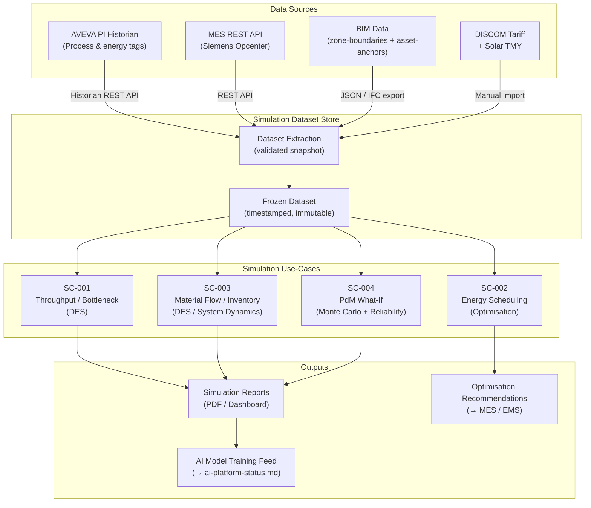

# Simulation Readiness Package

**Factory:** Coo-Cah Plastics & Polymers Factory (CCH-PLS)  
**Document:** Simulation Input Contract & Readiness Criteria v1.0  
**Status:** PLANNED — Input Contract Defined; Dataset Population Pending Commissioning  
**Artifact Grade:** 🟡 Planning — contract structure and use-case definitions complete; dataset fields require live commissioning data  
**Gate:** Gate 3 — BIM & Simulation Ready  
**Master Repo Reference:** [Coo-Kah-Doks — platform/digital-twin-platform-architecture.md](https://github.com/oumar-code/Coo-Kah-Doks/blob/main/platform/digital-twin-platform-architecture.md)

---

## 1. Purpose

This document defines the **simulation input contract** for the Coo-Cah Plastics & Polymers Factory (CCH-PLS) digital twin simulation layer. It specifies:

- What data inputs are required from BIM, the process historian, MES (Siemens Opcenter — confirmed per ADR-002 in Coo-Kah-Doks), and utilities systems
- The minimum validated dataset that must be frozen before each simulation use-case can execute
- The four priority simulation use-cases and their model boundaries
- The definition of done (Gate 3 acceptance criteria) for "simulation ready"

Simulation tools and frameworks are referenced by capability class, not by specific software product, to keep this document independent of vendor selection. Vendor selection is tracked in [docs/machinery.md](./machinery.md) and [docs/automation-roadmap.md](./automation-roadmap.md).

---

## 2. Simulation Input Contract

### 2.1 BIM Geometry Inputs

These inputs are sourced from [docs/bim/zone-boundaries.md](./bim/zone-boundaries.md) and [docs/bim/asset-anchors.md](./bim/asset-anchors.md).

| Input | Field | Source | Required Grade | Status |
|-------|-------|--------|----------------|--------|
| Zone geometry | Zone polygons (X,Y coords) for Zones A–H | `bim/zone-boundaries.md` | 🟡 P acceptable for layout-only simulation | 🟡 P |
| Zone clear heights | Clear height per zone (m) | `bim/zone-boundaries.md` + `floor-plan.md` | 🟡 P | 🟡 P |
| Zone floor loading | kN/m² per zone | `bim/zone-boundaries.md` | 🟡 P | 🟡 P |
| Asset X/Y/Z coordinates | Position per asset (m from NW datum) | `bim/asset-anchors.md` | 🟡 P acceptable for flow/throughput simulation; 🟠 C required for CFD/thermal simulation | 🟡 P |
| Asset BIM GUIDs | Unique identifier per asset | `bim/asset-anchors.md` | Planning GUIDs accepted until as-built model | 🟡 P |
| Zone interface points | Nominal X,Y coordinates of inter-zone doorways/openings | `bim/zone-boundaries.md` | 🟡 P | 🟡 P |

**Gate 3 requirement:** Zone polygons and asset coordinates must be ≥ Planning-grade. As-built grade required only for Phase 2+ CFD thermal simulation.

### 2.2 Process Historian Inputs

These inputs are sourced from AVEVA PI / Honeywell Uniformance historian via the paths defined in [docs/sensor-map.md](./sensor-map.md).

| Input Dataset | Tags Required | Time Resolution | Minimum History Window | Status |
|---------------|--------------|-----------------|------------------------|--------|
| Blown film extrusion parameters | `EXT-A1-01_TI_Z1–Z6`, `_TI_MELT`, `_PI_HEAD`, `_SI_SCREW`, `_II_MOTOR` | 1 s | 30 days continuous | ⛔ Pending commissioning |
| Blown film energy per run | `EXT-A1-01_PI_MOTOR`, `EXT-A1-01_FI_COOL`, `EXT-A1-01_TI_COOL_S/R` | 10 s | 30 days | ⛔ Pending commissioning |
| Extruder gearbox health | `EXT-A1-01_VIB_GB`, `EXT-A1-01_TI_GB` | RMS 1 s (raw 100 Hz for PdM) | 60 days (PdM baseline) | ⛔ Pending commissioning |
| PET preform IM process | `IM-B1-01_PI_INJ`, `_TI_BARREL`, `_PI_CLAMP`, `_SI_SCREW`, `_CT_CYCLE` | 100 ms (fast) / 1 s (standard) | 30 days | ⛔ Pending commissioning |
| PET SBM process | `SBM-B1-01_TI_OVEN_Z1–Z8`, `_PI_BLOW`, `_SI_STRETCH`, `_CT_BOTTLE` | 1 s / 100 ms | 30 days | ⛔ Pending commissioning |
| Utility load profiles | `CHILL-E1-01_*`, `COMP-E2-01/02_*` | 10 s | 30 days (seasonal variation preferred: 90 days) | ⛔ Pending commissioning |
| Solar generation | `SOLAR-E3-01_PI_GEN`, `_EI_GEN` | 1 s | 30 days | ⛔ Pending commissioning |
| BESS state and dispatch | `BESS-E3-01_SOC`, `_PI_CHRG`, `_TI_CELL_MAX` | 10 s | 30 days | ⛔ Pending commissioning |
| Grid import | `GRID-E3-01_PI_IMPORT` | 1 s | 30 days | ⛔ Pending commissioning |

**Acceptance condition:** All historian datasets must satisfy the data quality SLAs defined in [docs/sensor-map.md](./sensor-map.md) Section 5 before being admitted to the simulation dataset.

### 2.3 MES Inputs

These inputs are sourced from the MES REST API documented in [docs/mes-integration.md](./mes-integration.md).

| Input | MES Endpoint | Minimum Records | Status |
|-------|-------------|-----------------|--------|
| Production order history | `GET /production-orders` | ≥ 50 completed orders per product line | ⛔ Pending commissioning |
| OEE history per line | `GET /oee/{line}/{date}` | ≥ 30 days × all active lines | ⛔ Pending commissioning |
| Batch material consumption | `GET /materials/consumption/{order_id}` | Linked to all 50+ completed orders | ⛔ Pending commissioning |
| First-pass quality yield | `GET /quality/results` | ≥ 30 days × all active lines | ⛔ Pending commissioning |
| Batch cycle time records | `GET /production-orders/{id}/batch-record` | ≥ 50 orders | ⛔ Pending commissioning |
| Recipe parameter sets | MES recipe master (exported) | All Phase 1 SKU recipes: CCH-PLS-003, CCH-PLS-004 | 🟡 P (recipes documented in `mes-integration.md`) |
| Scheduled downtime / changeover log | `GET /reports/shift/{date}/{shift}` | ≥ 30 shift reports | ⛔ Pending commissioning |

### 2.4 Utility and Energy Inputs

| Input | Source | Requirement | Status |
|-------|--------|-------------|--------|
| Electricity tariff profile (grid) | DISCOM industrial tariff schedule | Time-of-use rates for 24-hour × 7-day profile | 🟡 P (to be obtained from DISCOM at contract signing) |
| Solar irradiance data | Historical weather data for Agbara/Sagamu site | 1-year TMY (Typical Meteorological Year) | 🟡 P (available from meteorological services) |
| Cooling water supply temperature | `CHILL-E1-01_TI_EVAP_S` (historian) + ambient temp correlation | 30-day profile | ⛔ Pending commissioning |
| Generator fuel consumption profile | `GEN-E3-01_LI_FUEL` historian decay | 30 days (if generator used) | ⛔ Pending commissioning |
| Compressed air demand | `COMP-E2-01/02_PI_MOTOR` historian | 30 days | ⛔ Pending commissioning |

### 2.5 QC and Recipe Context

| Input | Source | Requirement | Status |
|-------|--------|-------------|--------|
| CCH-PLS-003 blown film recipe parameters | `mes-integration.md` Section 3.2 | Zone temperatures, screw speed, BUR, nip speed ranges | 🟡 P |
| CCH-PLS-004 PET preform recipe parameters | `mes-integration.md` Section 3.2 | Barrel temps, injection pressure, cooling time ranges | 🟡 P |
| QC specification limits (film thickness, IV, AA) | QC lab specification sheets | Numeric LSL / USL per parameter | 🟡 P (to be sourced from QC lab at setup) |
| Historical QC reject reasons | `GET /quality/results` | ≥ 30 days of reject classification | ⛔ Pending commissioning |

---

## 3. Simulation Use-Cases and Model Boundaries

### 3.1 Use-Case SC-001 — Process Throughput and Bottleneck Analysis

| Attribute | Value |
|-----------|-------|
| Purpose | Identify the binding bottleneck constraint in the Phase 1 production system under different demand scenarios |
| Model type | Discrete-event simulation (DES) |
| Model boundary | Zone A (extrusion) + Zone B (moulding) + Zone C (raw material) + Zone H (finished goods) |
| Inputs required | MES production orders, OEE history, cycle times, changeover durations, recipe set |
| Outputs | Line utilisation per asset, queue build-up at bottleneck, throughput sensitivity to OEE improvement |
| Baseline dataset | 30-day MES history for CCH-PLS-003 and CCH-PLS-004 start-up lines |
| Tool capability class | Discrete-event simulation (e.g., Simul8, AnyLogic, Plant Simulation) |
| Phase | Phase 1+ (Month 6–18) — requires 30-day MES data window |

### 3.2 Use-Case SC-002 — Energy Scheduling Optimisation

| Attribute | Value |
|-----------|-------|
| Purpose | Determine optimal daily BESS charge/discharge schedule and production timing to minimise grid import cost and carbon footprint |
| Model type | Optimisation model (linear programming or heuristic dispatch) |
| Model boundary | Zone E (utilities + power systems) + production line scheduled loads |
| Inputs required | Solar irradiance TMY, electricity tariff profile, BESS SOC and capacity, per-machine power profiles from historian, production schedule from MES |
| Outputs | Optimal BESS dispatch schedule, predicted daily energy cost, solar self-consumption %, peak demand reduction |
| Baseline dataset | 30-day historian energy tags + solar/BESS tags; DISCOM tariff |
| Tool capability class | Optimisation solver (Python/PuLP, MATLAB, or integrated EMS/BEMS platform) |
| Phase | Phase 1+ (Month 6–18) — requires 30-day energy historian data |

### 3.3 Use-Case SC-003 — Material Flow and Inventory Simulation

| Attribute | Value |
|-----------|-------|
| Purpose | Validate raw material safety stock levels, silo replenishment cycles, and intragroup call-off SLA adherence under demand variability |
| Model type | Discrete-event / system dynamics simulation |
| Model boundary | Zone C (raw material warehouse) → Zone A/B (production) → Zone H (finished goods) → outbound dispatch |
| Inputs required | MES material consumption per batch, supply lead times from `supply-chain.md`, intragroup call-off rules from `intragroup-supply-coordination.md`, demand variability parameters |
| Outputs | Stockout probability per material, recommended safety stock levels, FG inventory holding vs. OTIF trade-off |
| Baseline dataset | 30-day MES material consumption data; supply chain lead times |
| Tool capability class | DES or system dynamics (Python/SimPy, AnyLogic, Vensim) |
| Phase | Phase 1 (Month 3–12) — can start with design parameters before live data; live MES data enriches from Month 6 |

### 3.4 Use-Case SC-004 — Predictive Maintenance What-If Analysis

| Attribute | Value |
|-----------|-------|
| Purpose | Model the production and cost impact of different extruder gearbox maintenance strategies (reactive vs. condition-based vs. time-based) |
| Model type | Monte Carlo + reliability model integrated with DES throughput model |
| Model boundary | Zone A extruder assets (EXT-A1-01 through EXT-A3-01); impact propagated through SC-001 throughput model |
| Inputs required | Gearbox vibration and temperature historian (60-day baseline), extruder MTBF/MTTR estimates (vendor data or early operational data), maintenance cost parameters |
| Outputs | Expected OEE impact per maintenance strategy, optimal inspection interval, cost–benefit analysis |
| Baseline dataset | 60-day gearbox vibration and temperature historian + vendor reliability data |
| Tool capability class | Monte Carlo simulation + Weibull reliability analysis (Python/SciPy, @RISK, or equivalent) |
| Phase | Phase 2 (Month 12–24) — requires 60-day gearbox sensor baseline |

---

## 4. Minimum Validated Dataset Requirements

The following dataset must be frozen and validated before each use-case can begin its first simulation trial run. "Frozen" means the dataset is extracted to a simulation-accessible store (flat files, data lake snapshot, or simulation platform import) and its extraction timestamp is recorded.

| Dataset Element | Minimum Window | Acceptance Check | Required For |
|-----------------|----------------|------------------|-------------|
| Blown film historian tags (EXT-A1-01 core set) | 30 days | Completeness ≥ 99%, bad-tag < 0.5% | SC-001, SC-004 |
| PET preform + SBM historian tags (IM-B1-01, SBM-B1-01) | 30 days | Completeness ≥ 99%, bad-tag < 0.5% | SC-001 |
| Energy historian tags (SOLAR, BESS, GRID, CHILL, COMP) | 30 days | Completeness ≥ 99%, bad-tag < 0.5% | SC-002 |
| MES production orders (CCH-PLS-003 and CCH-PLS-004) | ≥ 50 completed orders each | Batch records complete; OEE populated | SC-001, SC-003 |
| MES material consumption records | Linked to all orders above | 100% traceability completeness | SC-003 |
| Gearbox vibration + temperature (EXT-A1-01_VIB_GB, _TI_GB) | 60 days | Completeness ≥ 99%; no stuck-sensor periods | SC-004 |
| DISCOM electricity tariff profile | Current tariff schedule | Signed copy from DISCOM | SC-002 |
| Solar TMY irradiance data | 1-year TMY | Standard meteorological dataset for Agbara coordinates | SC-002 |
| Recipe parameter sets (CCH-PLS-003, CCH-PLS-004) | — | Exported from MES, validated against `mes-integration.md` | All use-cases |
| BIM zone geometry (Zones A, B, C, E, H) | — | Consistent with `bim/zone-boundaries.md` | SC-001, SC-003 |
| Asset coordinates (all Area A and B assets) | — | No TBD/null coordinates; consistent with `bim/asset-anchors.md` | SC-001 |

---

## 5. Simulation Toolchain and Integration Architecture

---

## 6. Definition of Done — Simulation Ready (Gate 3)

Gate 3 simulation readiness is declared **PASSED** when all of the following conditions are met:

### 6.1 Input Contract

- [ ] This document (simulation-readiness.md) is at version ≥ 1.0, reviewed, and signed by Engineering Lead, Smart Factory Lead, and Operations Lead.
- [ ] All "🟡 P / design-intent" fields in the input contract (Section 2) have been updated with actual values or confirmed as sufficient for the simulation use-case.
- [ ] Minimum validated dataset (Section 4) is frozen and accessible in the simulation dataset store.

### 6.2 BIM Inputs

- [ ] Zero `null` or placeholder values in the Zone and Asset fields required by SC-001 and SC-003 (Zones A, B, C, E, H; all Area A and B asset coordinates).
- [ ] BIM geometry consistent with `bim/zone-boundaries.md` and `bim/asset-anchors.md` — no version mismatch.

### 6.3 Historian Inputs

- [ ] All required historian datasets validated at 30-day completeness ≥ 99%, bad-tag < 0.5%.
- [ ] Gearbox vibration baseline meets 60-day window for SC-004.
- [ ] Data quality acceptance records signed by quality owners (per `sensor-map.md` Section 5.5).

### 6.4 Trial Simulation Runs

- [ ] At least one trial run executed for **each** of the four use-cases (SC-001 through SC-004).
- [ ] Trial run results reviewed in a joint engineering + smart factory + operations review session.
- [ ] Review sign-off recorded; identified data gaps and model calibration actions logged.

### 6.5 Cross-Document Consistency

- [ ] Asset IDs in simulation datasets match `digital-twin.md` Section 2 — no orphan IDs.
- [ ] Zone references match `bim/zone-boundaries.md` — no unknown zones.
- [ ] Historian tag paths match `sensor-map.md` instantiation mapping tables — no undocumented tags.

---

## 7. Cross-References

| Need | Document |
|------|----------|
| Sensor tag registry and data quality SLAs | [docs/sensor-map.md](./sensor-map.md) |
| Asset hierarchy and digital twin architecture | [docs/digital-twin.md](./digital-twin.md) |
| BIM zone geometry | [docs/bim/zone-boundaries.md](./bim/zone-boundaries.md) |
| BIM asset anchors | [docs/bim/asset-anchors.md](./bim/asset-anchors.md) |
| MES API endpoints and recipe parameters | [docs/mes-integration.md](./mes-integration.md) |
| AI model registry (Phase 2 consumers of simulation output) | [docs/ai-platform-status.md](./ai-platform-status.md) |
| Gate 3 readiness tracking | [docs/gap-closure-report.md](./gap-closure-report.md) |
| Energy profile and BESS sizing | [docs/energy-profile.md](./energy-profile.md) |
| Intragroup material flow rules | [docs/intragroup-supply-coordination.md](./intragroup-supply-coordination.md) |

---

## 8. Revision History

| Revision | Date | Author | Changes |
|----------|------|--------|---------|
| 1.0 | 2026-05-13 | Smart Factory Core Team | Initial simulation input contract; four use-case definitions; minimum dataset requirements; DoD for Gate 3 |

---

*Document maintained under Coo-Kah-Doks group standards. Simulation input contracts are living documents and must be updated at each programme gate.*
