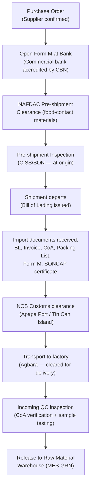
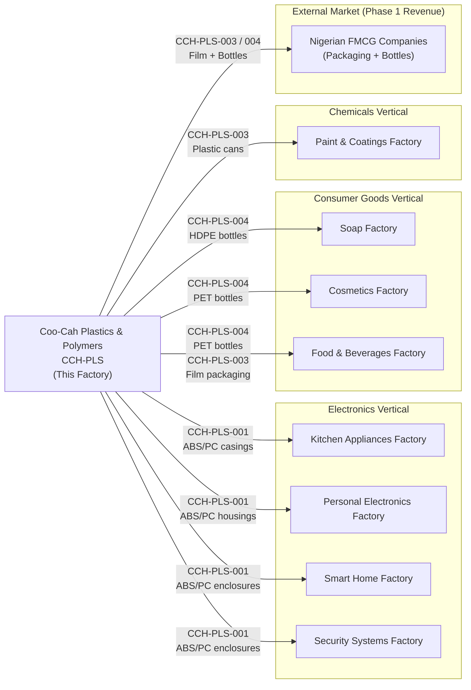

# Supply Chain

**Factory:** Coo-Cah Plastics & Polymers Factory (CCH-PLS)
**Document:** Supply Chain Strategy & Sourcing Plan v1.0
**Status:** PLANNED — Phase 1 Sourcing Basis
**Master Repo Reference:** [Coo-Kah-Doks / docs / supply-chain-doctrine.md](https://github.com/oumar-code/Coo-Kah-Doks)

---

## 1. Sourcing Philosophy

> **Local-first, quality-foremost.** Source as close to the factory as possible, from the highest
> quality available supplier. Import only when no viable domestic source exists or when domestic
> supply is unreliable. Never create single-source dependency for any Tier A material.

| Principle | Implementation |
|-----------|---------------|
| Local-first | INDORAMA (Port Harcourt) and Dangote (Lekki) are primary feedstock sources |
| Dual-sourcing | Every Tier A and Tier B material has a qualified backup supplier |
| Safety stock | 30-day stock for primary feedstocks; 90-day for catalysts and specialty additives |
| Intra-group preference | Prioritise internal Coo-Cah group supply where quality and economics permit |
| ESG compliance | All suppliers must meet NESREA and Nigerian environmental standards |

---

## 2. Strategic Suppliers — Tier A (Critical)

### 2.1 INDORAMA Eleme Petrochemicals — Primary PP/PE Supplier

| Attribute | Detail |
|-----------|--------|
| **Supplier Name** | Indorama Eleme Petrochemicals Ltd |
| **Location** | Eleme, Port Harcourt, Rivers State, Nigeria |
| **Distance from factory** | ~480 km by road (Port Harcourt → Lagos); rail / sea options available |
| **Products supplied** | PP (homo + random copolymer) granules, HDPE and LLDPE granules |
| **Annual capacity (supplier)** | ~760,000 MT/year polymer production |
| **Coo-Cah annual requirement** | Phase 1 Start: ~300 MT/month; Phase 1 Full: ~1,200 MT/month |
| **Tier classification** | **Tier A Critical** |
| **Why strategic** | Nigeria's largest domestic PP/PE producer; local currency pricing; no import duties; shortest supply chain for primary feedstock |
| **Logistics** | Road tanker trucks or bulk bags (25 kg); dedicated transport providers Lagos–PH corridor |
| **Lead time** | 5–7 days Port Harcourt to Agbara |
| **Payment terms** | Target: Net 30 days (negotiate with volume commitment) |
| **Safety stock policy** | **30 days' supply minimum** at all times |
| **Action required** | Sign Heads of Agreement (HOA) then long-term supply contract before production start |

**Risk Mitigation:**
- Indorama is a global Indian conglomerate — supply disruptions are low risk
- However: domestic logistics (road transport Lagos–PH corridor) is subject to delays
- Contingency: maintain 30-day stock + pre-qualified Asian import backup (see §3)

---

### 2.2 Dangote Petroleum Refinery — Strategic Feedstock Partner

| Attribute | Detail |
|-----------|--------|
| **Supplier Name** | Dangote Petroleum Refinery & Petrochemicals Ltd |
| **Location** | Lekki Free Zone, Lagos State, Nigeria |
| **Distance from factory** | ~60 km Lekki → Agbara Industrial Estate (same-day road transport) |
| **Products supplied** | Propylene; polymer intermediates; potentially PE/PP as downstream develops |
| **Capacity (refinery)** | 650,000 bpd crude — Africa's largest single-train refinery |
| **Petrochemical downstream** | Dangote has publicly stated plans for polypropylene and polymer downstream units |
| **Tier classification** | **Tier A Strategic** |
| **Why strategic** | Geographic proximity (60 km, same-day delivery); Dangote's own logistics fleet; Nigeria's largest refinery and a national infrastructure asset; potential captive domestic polymer supply as their downstream develops; early anchor customer positioning gives Coo-Cah preferential commercial terms |
| **Logistics** | Dangote's own trucking fleet (Dangote Logistics); road transport Lekki FZ → Agbara ~1.5–2 hrs |
| **Current supply scope** | Phase 1: propylene and naphtha/intermediates (if available); Phase 2+: PE/PP as Dangote's polymer units commission |
| **Action required** | Initiate commercial engagement with Dangote's Downstream Chemicals division; negotiate long-term offtake HOA for propylene; position as anchor customer for their polymer output |

**Strategic Rationale for Dangote Relationship:**
Dangote's refinery represents a transformational domestic feedstock opportunity. By engaging early
as an anchor domestic polymer buyer, Coo-Cah can negotiate pricing below import parity, benefit
from Dangote's logistics infrastructure, and build a long-term strategic relationship with Nigeria's
most significant industrial company. The 60 km road proximity eliminates the supply chain risk
inherent in all import alternatives.

---

## 3. Raw Material Sourcing Matrix

### 3.1 PP / PE (Polyolefins — Primary Feedstocks)

| Parameter | Primary Source | Secondary/Backup |
|-----------|---------------|-----------------|
| Supplier | INDORAMA Eleme Petrochemicals | Asian producers (Formosa, Reliance, Sinopec) via Apapa Port |
| Location | Port Harcourt, Nigeria | India / China / Taiwan |
| Lead time | 5–7 days | 30–45 days (sea freight + port clearance) |
| Pricing basis | Naira contract (negotiate quarterly) | USD CIF Apapa |
| Safety stock | 30 days | 30 days |
| Import duty | Nil (domestic) | 5% CET + VAT (ECOWAS CET) |
| Form M required | No | Yes |
| NESREA permit | Standard environmental compliance | Import permit for polymer raw materials |
| Annual volume (Phase 1 Full) | ~900 MT/month primary | ~300 MT/month backup |

**Products by grade:**
- PP Homopolymer (MI 2–12 g/10min): blown film, injection moulding
- PP Random Copolymer: clarity packaging applications
- LLDPE (C8, density 0.918–0.922): blown film sealant layer
- LDPE (MI 0.3–2.0): blown film bubble stability
- HDPE (density 0.955–0.965): pipe extrusion, crates, containers

---

### 3.2 PET Resin (Polyethylene Terephthalate)

| Parameter | Phase 1 Import | Phase 2+ Target |
|-----------|----------------|-----------------|
| Primary source | India (Reliance Industries) / China (Sinopec, Zhongyuan) | Explore domestic Nigeria / West Africa |
| Secondary source | Europe (Indorama Ventures, Indonesia / Thailand) | — |
| Grade | Bottle-grade PET, IV ≥ 0.78–0.82 dl/g, AA ≤ 1 ppm | Same |
| Lead time | 30–45 days (sea freight via Apapa Port) | TBD |
| Safety stock | **30 days minimum** (extended due to import lead time) | — |
| Form M | Yes — required for all imports | — |
| NAFDAC | Food-contact declaration required from supplier | — |
| Annual volume (Phase 1 Full) | ~200 MT/month | — |

---

### 3.3 Catalysts and Process Additives

| Material | Source | Lead Time | Safety Stock |
|----------|--------|-----------|-------------|
| Antioxidants (Irganox, Irgafos) | BASF (Germany) / Clariant (Switzerland) via agent | 45–60 days | **90 days** |
| UV stabilisers | Cytec / Solvay via import agent | 60 days | 90 days |
| Slip / anti-block agents | Croda / Evonik via import agent | 45–60 days | 90 days |
| Nucleating agents (PP) | Milliken (USA) via import agent | 60–75 days | 90 days |
| Acetaldehyde scavengers (PET) | Polyone / Avient / ColorMatrix | 45–60 days | 90 days |
| Masterbatch (colour) | Local blenders (Lagos) — priority | 3–5 days | 14 days |
| Masterbatch (white/black) | Local blenders (Lagos) | 3–5 days | 14 days |
| Process lubricants | Local industrial suppliers | 2–3 days | 21 days |

> **90-day safety stock for additives is mandatory** due to import lead times and the critical
> nature of these materials for product quality and compliance.

---

### 3.4 Packaging, Cartons & Labels

| Material | Local (Lagos) | Import |
|----------|--------------|--------|
| Corrugated cartons | 90% local — multiple Lagos-based carton suppliers | 10% (specialty grades only) |
| Stretch film / pallet wrap | Local (or produced in-house — CCH-PLS-003) | Nil |
| Labels / printed film | Local label printers — 5+ qualified suppliers in Lagos | 5% (specialty) |
| Inks / adhesives | Local industrial supply | Nil standard grades |

---

### 3.5 Utilities and Industrial Gases

| Utility | Supplier | Source |
|---------|----------|--------|
| Compressed nitrogen | BOC Nigeria / Afrox Nigeria | Lagos / Ikorodu |
| Compressed oxygen | BOC Nigeria / Afrox Nigeria | Lagos |
| Process water | Municipal (Agbara) + borehole backup | Local |
| Diesel fuel | NNPCL / Total Energies / Ardova — local filling | Agbara area |
| Industrial gas (general) | Multiple local suppliers | Lagos/Ogun State |

---

## 4. Import Protocol

### 4.1 Form M Process (NCS — Nigeria Customs Service)

All polymer raw material imports must comply with NCS Form M procedures:

**Key Import Compliance Requirements:**

| Requirement | Authority | Notes |
|-------------|-----------|-------|
| Form M | CBN / NCS | Mandatory for all goods imports > $100 |
| SONCAP certificate | SON | Standards Organisation of Nigeria — product conformity |
| NAFDAC import permit | NAFDAC | Required for food-contact plastic materials |
| HS code classification | NCS | Correct tariff classification to determine CET duty |
| CISS / Pre-shipment inspection | NCS/SON | Required at origin for regulated goods |
| Packing list + commercial invoice | NCS | Required for all shipments |
| Bill of Lading (OBL or Telex) | Shipping line | Sea freight documentation |

---

### 4.2 Hazardous Materials Import (NESREA + DPR Requirements)

| Requirement | Detail |
|-------------|--------|
| NESREA permit | Environmental permit for import of hazardous chemical additives |
| Material Safety Data Sheets (SDS) | Required for all hazardous materials — pre-import |
| UN classification | All hazardous imports must carry correct UN number and packaging class |
| Port handling | Declare hazmat to Apapa Port Authority; segregated stacking |
| Transport | Licensed hazmat transport contractor (ADR-equivalent standard) |
| Factory receipt | Dedicated hazmat receiving procedure, PPE for unloading |
| Storage | Zone D (Hazmat Store) — see floor-plan.md |

---

## 5. Intra-Group Supply Flows (Outbound)

This factory is the primary internal plastic component supplier to all other Coo-Cah verticals.

### 5.1 Supply Relationships

### 5.2 Intra-Group Supply Agreement Framework

| Parameter | Standard |
|-----------|----------|
| Pricing | Transfer price at cost + 12% internal margin (reviewed annually) |
| Lead time | 5 working days standard; 2 days expedite |
| Quality standard | Same as external customers — all CCH-PLS QC specifications apply |
| Forecasting | Receiving factories provide rolling 13-week demand forecast every Monday |
| Order process | Purchase order via ERP (SAP/Odoo) — MES picks up and schedules |
| Delivery | Coo-Cah internal logistics (shared truck fleet) or 3PL |
| Dispute resolution | Escalation to Coo-Cah Holdings supply chain committee |

---

## 6. Safety Stock Policy

| Material Category | Minimum Safety Stock | Rationale |
|-------------------|---------------------|-----------|
| PP/PE granules (domestic INDORAMA) | 30 days | Domestic; 5–7 day lead time but logistics disruption risk |
| PP/PE granules (import backup) | 30 days | 30–45 day import lead time — pre-position before stockout |
| PET resin (import) | 30 days | 30–45 day import lead time |
| Catalysts and additives (import) | **90 days** | 45–75 day lead times; supply disruption is production-stopping |
| Masterbatch / colour (local) | 14 days | Local supply — short lead time |
| Packaging cartons / labels | 14 days | Local supply — multiple suppliers |
| Diesel fuel | 72 hours (2,000 L day tank) | Emergency backup only |

**Inventory Monitoring:**
- Daily stock level reporting from MES → ERP
- Automatic purchase requisition trigger at safety stock + 20% buffer
- Monthly stock reconciliation
- Annual physical inventory count (ISO 9001 requirement)

---

## 7. Supplier Qualification Process

All new suppliers must complete the Coo-Cah Supplier Qualification procedure before any material
is accepted into production:

1. Submit completed Supplier Qualification Questionnaire (SQQ)
2. Provide ISO 9001 certificate (or equivalent QMS evidence)
3. Submit product specifications and typical CoA data
4. Pass incoming material QC testing (minimum 3 production lots)
5. Complete NESREA compliance declaration (for hazardous materials)
6. Sign Coo-Cah Supplier Code of Conduct
7. Approval by Procurement + Quality Manager
8. Registration in MES supplier master

Use the GitHub Issue template: `.github/ISSUE_TEMPLATE/supplier-qualification.md`

---

*Document maintained under Coo-Kah-Doks group standards.*
